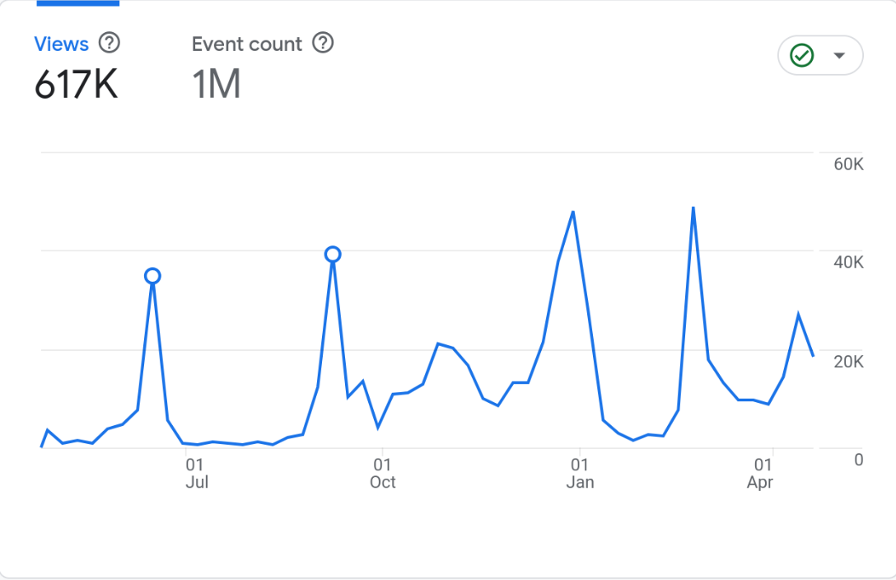

来看看我们这一年的成果吧。

---

<PostDetail>

## 概况

自 2024 年 4 月 28 日 BYR Docs 开站以来，我们通过各种渠道收集了大量的电子书和试题。现如今，BYR Docs 共存有 379 份电子书，447 份试题[^1]和 161 份零散资料。这其中的大部分资料均由本站的用户提供，在此我谨代表 BYR Docs 向各位老师同学致谢。

相比于其它资源站点来说，BYR Docs 最重要的特色便是能**及时提供最新的资料**。很多用户苦于新出版的教材没有电子版，我们便开设了[电子书愿望单](https://github.com/orgs/byrdoocs/discussions/2)，根据大家需要，自行购买书藉进行扫描，或者委托专门的商家进行扫描。

BYR Docs 现存 29 份出版于 2022 年至 2025 年的教材，包括《人工智能导论》第二版、《计算机组成原理》第七版、《电磁场与电磁波》第五版、《通信电子电路：微课版》、《电子电路基础》第三版》等，其中便有不少是我们自行制作的。

同时，我们也在通过不同手段获取最新的考试真题。建站伊始，我们拥有的试卷还大多是疫情及之前的早期试卷；后来，随着用户数不断增加，也陆续有人开始向我们提供较新的试卷。到了 2024 年 6 月期末考试之后，我们甚至收到了 8 份当学期的期末试题。

后来上线的[维基真题](https://wiki.byrdocs.org)则为试题收集过程开创了新的局面。从那以后，我们不必彻底依赖老师（或其他中间人）了；我们自己就可以把试卷内容记下来，再加以整理。在「开卷就抄，闭卷就背」的宗旨下，我们仅用两星期就整理出了二十余份试题。其中最为成功的案例，当属由我亲自组织 10 位同学合力抄成的[《脑与认知科学》真题](https://wiki.byrdocs.org/w/24-25-1-%E8%84%91%E4%B8%8E%E8%AE%A4%E7%9F%A5%E7%A7%91%E5%AD%A6-%E6%9C%9F%E6%9C%AB)。

[^1]: 该数据不包含维基真题的试题数。主站试题和维基试题有部分重复，故分开讨论。

## BYR Docs 主站数据

过去一年，BYR Docs 主站的浏览量为 57.1 万次，文件下载量为 41.7 万次。

网站访问的高峰出现在每学期的学期初（要下载教材）、期中和期末（要下载往年题）三个阶段。

其中下载量最多的电子书是：
- [《工科数学分析基础 上册》](https://byrdocs.org/?q=90e9d85ea86d4716780a7bbafecb767c) 3572次
- [《线性代数与几何》](https://byrdocs.org/?q=950abd598f29ecf5fbae8fc3b0092588) 3157次
- [《概率论与数理统计》](https://byrdocs.org/?q=ea80087009e8bcf78dbc45f475890fb8) 2688次
- [《电子电路测量与设计实验》](https://byrdocs.org/?q=0d696116eb3937a892c6bdffc6b6a203) 2586次
- [《工科数学分析基础 下册》](https://byrdocs.org/?q=5e8a15d1410d9831b6c93c8b62e387bb) 2422次

除去人文/思政类课程之外，上课人数较多的课程，相应教材的下载量也较多。

下载量最多的试卷是：
- [2019-2020 第一学期《马克思主义基本原理》期末](https://byrdocs.org/?q=ebf74504a5c50d3b08c804e244e27499) 1920次
- [2023-2024 未知学期《概率论与数理统计》期末](https://byrdocs.org/?q=3a1e5aa0ec64e12498c7b42218571ead) 1441次
- [2022-2023 第二学期《大学物理E（上）》期末](https://byrdocs.org/?q=ffda74da2cc11a76c32b580b47daebb5) 1379次
- [2019-2020 第一学期《数学分析（上）》期中](https://byrdocs.org/?q=4345526830c15162b3918f828ae52cae) 1278次
- [2019-2020 未知学期《线性代数》期末](https://byrdocs.org/?q=89c05d7717bf876abd175788b3ff4301) 1242次

下载量最多的试卷未必是最新的，**但一定是带答案的**。所以说，一昧地更新试题其实效果有限；最重要的是答案的更新。

## 维基真题数据

维基真题自投入使用以来，共有 1042 笔编辑，61 份试题，38 名注册用户。近期有 7 名活跃编辑者。维基真题的访问量相比主站来说非常少，只有 0.3 万次。

在现有的 61 份试题中，位于 2024-2025 学年第一学期的试题有 39 份；位于 2024-2025 学年第二学期的试题有 6 份。若论试题新鲜度，维基真题可以说是首屈一指的。但遗憾的是，这些试题大都缺少答案。从用户需求的角度上看，它们能够提供的价值相当有限。

维基有它的优势，它支持所有人编辑，因此任何人都可以向题目中补充答案；而完整的答案正是用户们最需要的内容。

可惜目前我们还未能建立起完善的社群环境，要想让维基真题大放异彩仍然任重道远。

## 财务清单

我们坚持不接受捐赠，所以没有收入。

以下列出支出清单：

| 项目 | 支出额 (¥) |
|---|---|
| 域名 | 56.48 |
| 委托扫描 9787563566426 | 35.00 |
| 委托扫描 9787563569397 | 50.00 |
| 委托扫描 9787563571635 | 50.00 |
| 委托扫描 9787115632371 | 60.00 |
| 委托扫描 9787302575030 | 35.00 |
| 委托扫描 9787563558476 | 30.00 |
| 委托扫描 9787115649126 | 65.00 |
| 委托扫描 9787563569380 | 40.00 |
| 委托扫描 9787040367560 | 35.00 |
| 购买 9787302663447 | 51.70 |
| 委托扫描 9787302663447 | 26.00 |
| 购买 9787563571437 | 37.10 | 
| 委托扫描 9787563571437 | 26.00 |
| 购买 9787563573639 | 26.00 |
| 委托扫描 9787563573639 | 25.00 |
| 购买 9787040617214 | 52.70 |
| 购买 9787040631722 | 30.80 |
| 委托扫描 9787040617214 9787040631722 | 75.00 |
| 购买 9787121474293 | 59.80 |
| 委托扫描 9787121474293 | 55.00 |
| 购买 9787563574919 | 62.40 |
| 委托扫描 9787563574919 | 35.00 |

总计支出 ¥1018.98。

## 大事年表

- **2024年4月28日**：[BYR Docs](https://byrdocs.org)开站
- **2024年6月20日**：[BYR Docs QQ群](https://qm.qq.com/cgi-bin/qm/qr?k=plu_KgkqxI4Dw-FwW1aFQDQ0hL062WNV&jump_from=webapi&authKey=09aiBE16MH9jTfmgmGtCjMRsvpazAMkvLcG35mdICYHe2+FKF51qqSIdUC0dVxkh)建立
- **2024年7月23日**：[电子书愿望单](https://github.com/orghttps://wiki.byrdocs.org/w/24-25-1-通信原理-期末s/byrdocs/discussions/2)建立
- **2024年11月26日**：面向一般用户[开放文件上传](https://blog.byrdocs.org/blog/posts/how-to-organize-test/post.html)
- **2024年12月3日**：子站[维基真题](https://wiki.byrdocs.org)试运行
- **2025年2月24日**：主站与维基实现信息合并

---

> 如果你认为我们的项目帮到了你，烦请为我们的 [GitHub 仓库](https://github.com/byrdocs/byrdocs-archive)点一个 Star！

</PostDetail>
