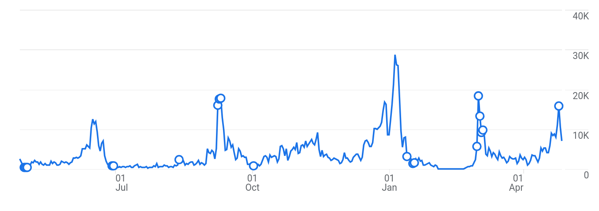
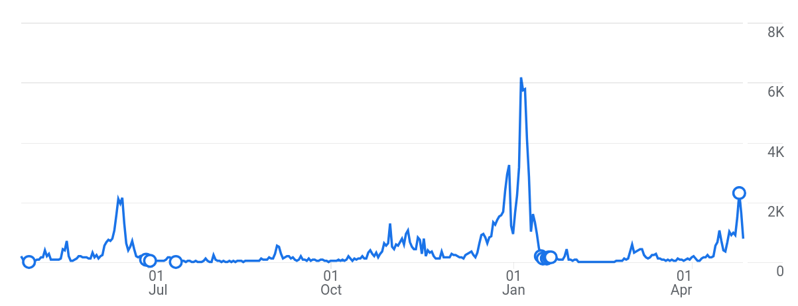
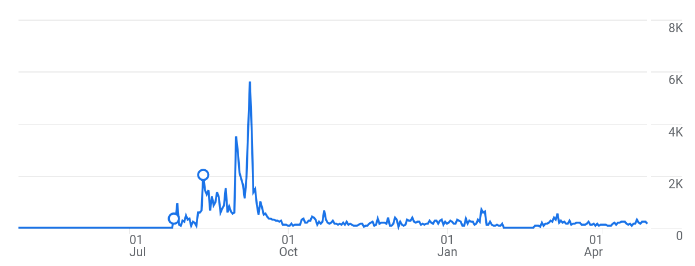
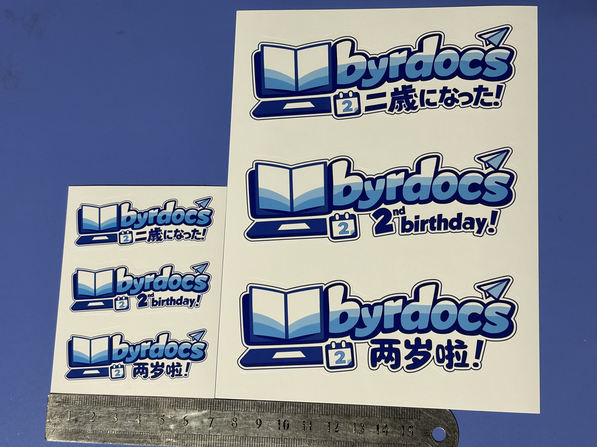
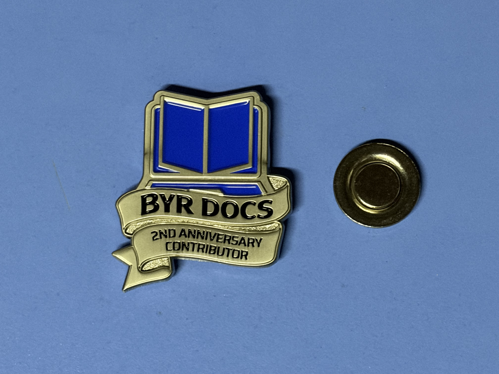

来看看我们新一年的成果吧。

---

<PostDetail>

## 概况

自 2024 年 4 月 28 日 BYR Docs 开站以来，我们通过各种渠道收集了大量的电子书和试题。现如今，BYR Docs 共存有 373 份电子书，566 份试题[^1] 和 168份零散资料。这其中的大部分资料均由本站的用户提供，在此我谨代表 BYR Docs 向各位老师同学致谢。

[^1]: 该数据不包含维基真题的试题数。主站试题和维基试题有部分重复，故分开讨论。

细心的读者不难发现，相比[去年](/blog/posts/anniversary-1/post.md)我们的电子书数量未升反降。这是因为我们在过去一年间集中清理了一批没有需求的电子书。这些资料大多来自早期 BYR Docs 无序扩张的阶段，彼时我们不加辨别地接受了许多鱼龙混杂的文件。随着 BYR Docs 业务逐步进入正轨，我们也在不断清除过往的劣质遗存。

内容的时效性是 BYR Docs 一贯的追求。过去一年，我们通过[维基真题](https://wiki.byrdocs.org)项目吸引了不少同道中人，通过合力记背题目，有效还原出了五十余份期末试题。今年，已经有不少学生开始受益于维基真题的协作成果。仍以[《脑与认知科学》](https://wiki.byrdocs.org/w/24-25-1-%E8%84%91%E4%B8%8E%E8%AE%A4%E7%9F%A5%E7%A7%91%E5%AD%A6-%E6%9C%9F%E6%9C%AB)为例，作为未来学院新开设的课程，这份由我亲自组织抄成的试卷，几乎是 23 级学生了解试卷题型的唯一途径。现如今，还有不少科目并没有足够的往年题可供参考（诸如数电系列的课程），但也已经有人行动起来，开始为后人回顾试题（诸如[2025-2026年第一学期《数字电路与逻辑系统》的期末试题](https://wiki.byrdocs.org/w/25-26-1-%E6%95%B0%E5%AD%97%E7%94%B5%E8%B7%AF%E4%B8%8E%E9%80%BB%E8%BE%91%E7%B3%BB%E7%BB%9F-%E6%9C%9F%E6%9C%AB)）。我们相信，这种代际互助的理念会随着维基真题的成长而逐渐深入人心。

[BUPT 生存手册](https://guide.byrdocs.org) 则是另一种代际互助的实践。在这里，我们将常见的学习生活问题整理成若干主题，以备查阅。我曾于八月末赶赴新装修的六人间宿舍，测量出[宿舍尺寸的一手资料](https://guide.byrdocs.org/%E6%B2%99%E6%B2%B3%E6%A0%A1%E5%8C%BA/%E5%85%AD%E4%BA%BA%E9%97%B4%E5%B8%83%E5%B1%80/)；也在多个群组收集问题，查找资料，实地走访，确认校医院的就医和报销流程。在此基础上，我们才能提供最新，最全，最完整的情报。

我本人的确在这些工程中出力不少，但以上成果远非我一人之力可以做出。自 BYR Docs 创立以来，我们就在不断提高项目的去中心化程度，一方面是为了提高用户的参与度，另一方面也是为了让 BYR Docs 的理念得以延续，而不至于当我有朝一日离开之后彻底失传。

我们搭建了 BYR Docs Publish。从此，所有用户都可以通过简洁的流程，方便地向 BYR Docs 贡献文件。

我也很高兴看到，越来越多富有热情的同学们愿意协助我们进一步推进维基真题和 BUPT 生存手册的编辑工作。他们的热情使我相信 BYR Docs 的工作是可以持续下去的，也使我相信我们为搭建这套基础设施所做出的努力是值得的。

时至今日，BYR Docs 已经形成了一套完善的基础设施。的我们不仅完全开放了 BYR Docs 各子项目的源代码，还撰写[文档](/blog/posts/reproduce-byrdocs/post.html)将 BYR Docs 的搭建方法公诸于世。这样一来，哪怕终有一天 BYR Docs 关停了，后人也可以通过我们搭建好的基础设施，复现出下一个“BYR Docs”。

顺便一提，不久前我了解到，来自上海财经大学的 [XSUFE 团队](https://github.com/XSUFE) 正在二次开发 BYR Docs 的项目，以打造上海财经大学资料分享平台 SUFEDocs。我谨代表 BYR Docs 预祝 SUFEDocs 取得成功。

## BYR Docs 各子项目数据

过去一年，BYR Docs 全站访问量为 136.4 万次。BYR Docs 主站访问量 96.8 万次，文件下载、预览次数共计 20.9 万次。

网站访问的高峰主要出现在每学期的学期初、期中和期末。学期初大家的主要需求是下载电子书，而期中和期末则是查阅往年题。

主站下载量最多的电子书有：

- [《通信原理》](https://byrdocs.org/?q=d0741d59183c727ee64529eba045ad5d) 2892 次
- [《工科数学分析基础 下册》](https://byrdocs.org/?q=5e8a15d1410d9831b6c93c8b62e387bb) 2866 次
- [《工科数学分析基础 上册》](https://byrdocs.org/?q=90e9d85ea86d4716780a7bbafecb767c) 2210 次
- [《概率论与数理统计》](https://byrdocs.org/?q=ea80087009e8bcf78dbc45f475890fb8) 2026 次
- [《线性代数与几何》](https://byrdocs.org/?q=950abd598f29ecf5fbae8fc3b0092588) 1949 次

主站下载量最多的试题有：

- [2024-2025 第一学期 信息通信概论A 期末试卷](https://byrdocs.org/?q=39b04eab3814221ca8543e279aae7504) 2391 次
- [2022-2023 第一学期 计算机导论 期末试卷](https://byrdocs.org/?q=abbca304e38fa2da7a618a9c0b97be6c) 2294 次
- [2024-2025 第一学期 数据结构 期末试卷](https://byrdocs.org/?q=49199af7eb157bf33b73602e61683f06) 2057 次
- [2023-2024 第一学期 线性代数 期末试卷](https://byrdocs.org/?q=bd34881f9f6a917a05a9b85ea3a31665) 1775 次
- [2024-2025 第二学期 数学分析（下） 期中试卷](https://byrdocs.org/?q=abfc2cf7a88488c8cc474c26de5c957e) 1727 次

下载量较多的试题多数都是大一科目，但这未必意味着大一学生对本站的需求更大，只能说《信息通信概论A》《线性代数》这类课程的修读学生太多了。

### 维基真题

过去一年，维基真题访问量为 14.1 万次，期间共有来自 116 个署名或匿名编辑者作出了 1304 笔编辑。

维基真题现存 39 份 2024-2025 学年第二学期的试题、24 份 2025-2026 学年第一学期的试题。它们大多由参考学生回忆整理而成。

我们原本想要把维基真题打造成一个方便用户编写答案的题库，不过现在看来，维基真题正在朝着收集零散题目的方向演化。

### BUPT 生存手册

过去一年，BUPT 生存手册的访问量为 10.0 万次。其中[《沙河六人间布局》](https://guide.byrdocs.org/%E6%B2%99%E6%B2%B3%E6%A0%A1%E5%8C%BA/%E5%85%AD%E4%BA%BA%E9%97%B4%E5%B8%83%E5%B1%80/)的访问量达 1.4 万次，可以说是新生了解宿舍情报最全面的途径。

生存手册能做到这种程度已然不易，因为它的访问量几乎全部是在 2025 年 9 月（新生入学）期间产生的，平时鲜有人使用。要确认它的关注度，还宜等 26 级新生入学时再观察。

## BYR Docs 二周年纪念品

为了感谢所有用户长期以来的支持，我们制作了一批二周年纪念品，免费发放给大家。纪念品分为所有人皆可领取的常规纪念品，以及专为贡献者准备的特别纪念品。

### 常规纪念品

BYR Docs 常规纪念品是大小贴纸各500张，每张包含中英日三种语言的贴纸。

### 特别纪念品

特别纪念品仅为直接参与贡献了 BYR Docs 各子项目的贡献者，在登记时间内共有 35 人登记。

特别纪念品包含一张卡片，卡片上统计了用户两年来的贡献数。

以及一个 BYR Docs 二周年定制徽章，徽章背面可以吸附一枚磁铁环。

徽章与卡片上的设计图等大，包装时会将徽章叠放到设计图上，磁铁环置于卡片后方吸附。

## BYR Docs 财务状况

我们坚持不接受捐赠，所以没有收入。

以下列出支出清单：

| 项目 | 支出额 |
|---|---|
| 域名 | $10.13 |
| Cloudflare 订阅及其它 | $34.76 |
| 购买 9787563563272 | ¥33.50 |
| 委托扫描 9787563563272 | ¥30.00 |
| 购买 9787121460463 | ¥32.90 |
| 委托扫描 9787121460463 | ¥22.00 |
| 购买 9787302676690 | ¥36.90 |
| 委托扫描 9787302676690 | ¥26.00 |
| 购买 9787563573875 | ¥36.70 |
| 委托扫描 9787563573875 | ¥20.00 |
| 购买 9787563573080 | ¥39.77 |
| 委托扫描 9787563573080 | ¥40.00 |
| 购买 9787302699750 | ¥53.20 |
| 委托扫描 9787302699750 | ¥30.00 |
| 购买 9787121491092 | ¥44.00 |
| 委托扫描 9787121491092 | ¥35.00 |
| BYR Docs 贡献者徽章设计 | ¥80.00 |
| BYR Docs 贡献者徽章建模 | ¥240.00 |
| BYR Docs 贡献者徽章制作 | ¥1300.00 |
| BYR Docs 贡献者卡片设计 | ¥100.00 |
| BYR Docs 贡献者卡片制作 | ¥36.00 |
| 贡献者卡片附件-磁铁 | ¥9.67 |
| BYR Docs 纪念品贴纸 | ¥554.00 |
| oop不干胶自粘袋 | ¥7.64 |

总计支出 $44.89 + ¥2807.28。

## 大事年表
- 2025 年 6 月 20 日，[BYR Docs Publish](https://publish.byrdocs.org) 建立
- 2025 年 7 月 19 日，[BUPT 生存指南](https://guide.byrdocs.org)建立
- 2026 年 3 月 1 日，发表[《从零搭建 BYR Docs 网站》](/blog/posts/reproduce-byrdocs/post.md)
---

> 如果你认为我们的项目帮到了你，烦请为我们的 [GitHub 仓库](https://github.com/byrdocs/byrdocs-archive)点一个 Star！
</PostDetail>
