以一份《大学物理D》试题文件为例，介绍如何将试题录入维基真题。

---

<PostDetail>

## 前言

前不久，我们为维基真题带来了一个全新的版本。在新版维基真题中，我们提供了更简洁直观的界面，更快的加载速度，更便捷的文件管理，并且将试卷编辑语言改为基于 Markdown 的语法，还为 VS Code 编辑者设计了编辑插件，以提供更好的编辑体验。

为了指引读者充分利用新维基的编辑功能，我撰写了这篇操作教程，以供参考。

下面，我以一份《大学物理D》的试题为例，介绍如何将试题文件录入维基真题。这份试题保存在 [BYR Docs 主站](https://byrdocs.org/?c=test&q=8f53d27f673902effc9214679c2890c2)上。

## 准备工作

### 前置条件

- 有一个 GitHub 账号；
- 安装 [Git](https://git-scm.com/)；
- 安装 [Node.js](https://nodejs.org/en)，详细过程可见[下文](#在-windows-上安装-node-js-和-pnpm)；
- 安装 [pnpm](https://pnpm.io/)。

### 在 Windows 上安装 Node.js 和 pnpm

此处演示通过 Windows x64 安装程序安装的操作。

首先前往[官网](https://nodejs.org/zh-cn/download)，下载 Windows 安装程序(.msi)。

运行文件，一路勾选。但其中的 `Automatically install the necessary tools. Note that this will also install Chocolatey. The script will pop-up in a new window after the installation completes.` 选项**不需要**勾选。

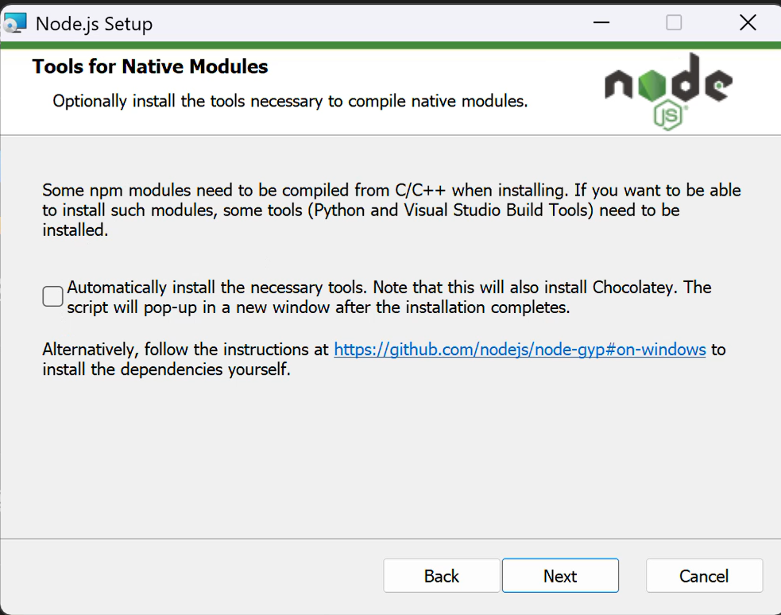

安装完成后打开终端，键入命令：
``` bash
node -v
npm -v
```
输出版本号说明安装成功。

接下来安装pnpm，继续输入：
``` bash
npm install -g pnpm
```

### Fork 并克隆仓库到本地

前往 https://github.com/byrdocs/byrdocs-neowiki ，点击右上角的 `Fork` 按键，页面跳转后点击 `Create fork`。

接下来在你 fork 的仓库页面点击绿色的 `<>Code` 按键，复制出现的URL。

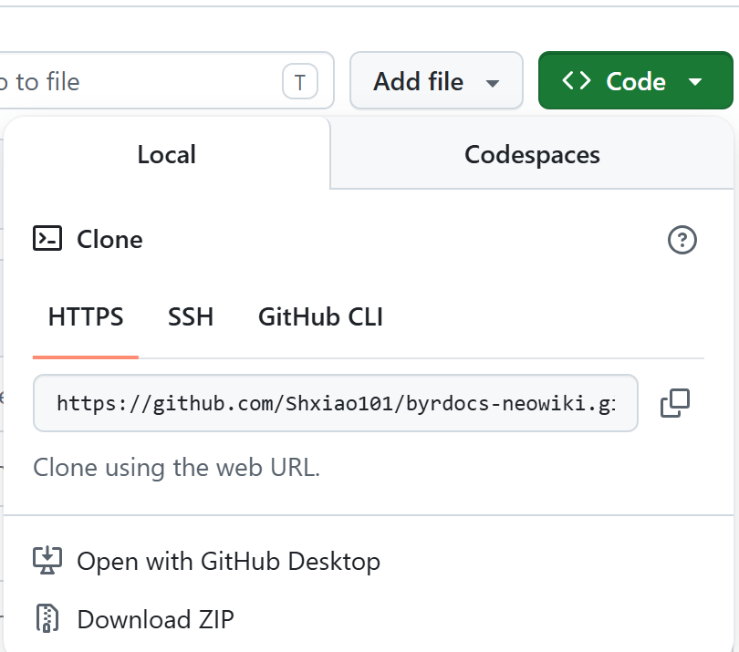

打开任意终端，在你要安装的位置键入命令：
``` bash
git clone <你刚才复制的URL>
```

### 安装必要依赖
等待克隆完成后进入byrdocs-neowiki目录，安装依赖
``` bash
cd byrdocs-neowiki
pnpm i
```
启动预览服务器：
``` bash
pnpm dev
```
接下来你可以在 http://localhost:4321 进入维基真题首页。（如果 4321 端口已被占用，则会使用其它端口，你可在 dev 信息中看到）

## 编辑试卷
编辑前请务必仔细阅读维基真题的[编辑指南](https://wiki.byrdocs.org/guide/)。它会指引你按照维基真题的格式规范进行录入。

### 在vscode编辑试卷
我们提供了 VS Code 扩展方便编辑者预览页面，请在 VS Code 扩展商店安装 [BYR Docs Wiki Tools](https://marketplace.visualstudio.com/items?itemName=byrdocs.byrdocs-wiki-vscode)。该扩展只有在你当前已打开进入 byrdocs-neowiki 文件夹时才会启用，请确保你的vscode所在根目录为byrdocs-neowiki。

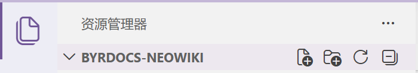

另外，如果你当前处于受限模式，请设置信任该文件夹，否则无法使用扩展。或者在设置中找到`Security>Workspace>Trust:Enabled`将其永久关闭。

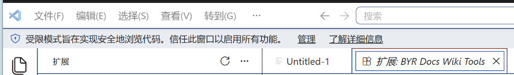

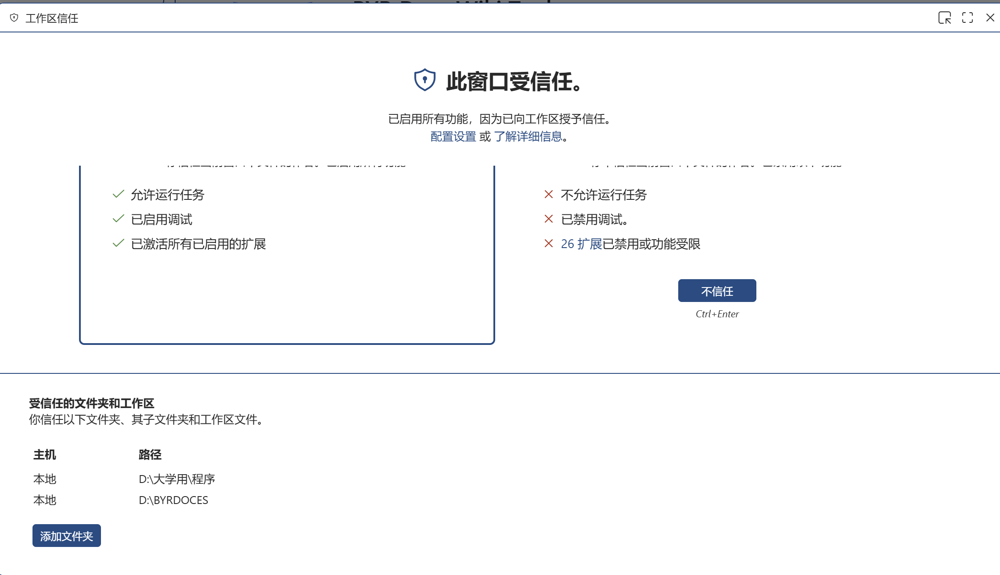

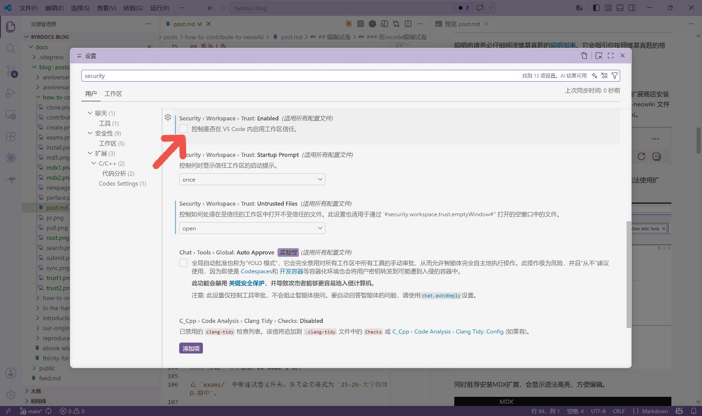

同时推荐安装MDX扩展，会显示语法高亮，方便编辑。

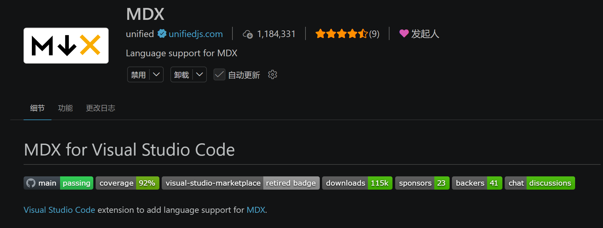
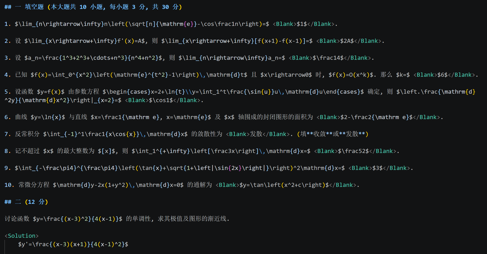

打开 byrdocs-neowiki 文件夹。在编辑试题时，我们只需要关注其中的 `exams/` 目录即可。

我们有两种方法添加这份试卷。

#### 方法一（不依赖 VS Code 扩展）

在 `exams/` 中新建试卷文件夹，参考命名格式为 `25-26-大学物理D-期中`。

然后进入该试卷文件夹，新建试卷文件 `index.mdx`。本试卷还有不少题图附件，这些附件都要按照它们的功能命名，一并放入此文件夹中。

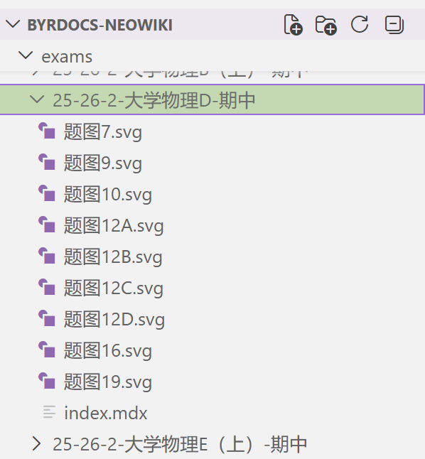

首先我们需要在 `index.mdx` 中写入**前言**，描述这份试题的基本信息。

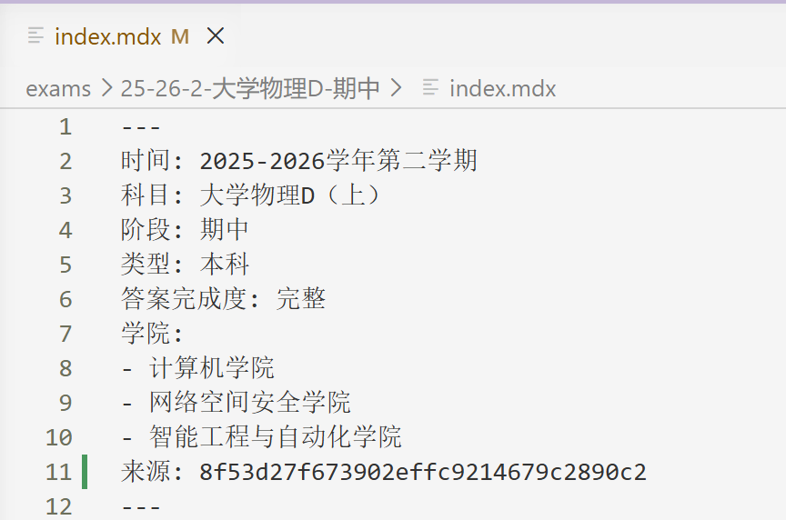

其中 `来源` 为 [BYR Docs主站](https://byrdocs.org)已有试卷的md5，可在网站的试卷搜索结果的右下角复制得到。如果它不位于 BYR Docs 主站，可不写此项。

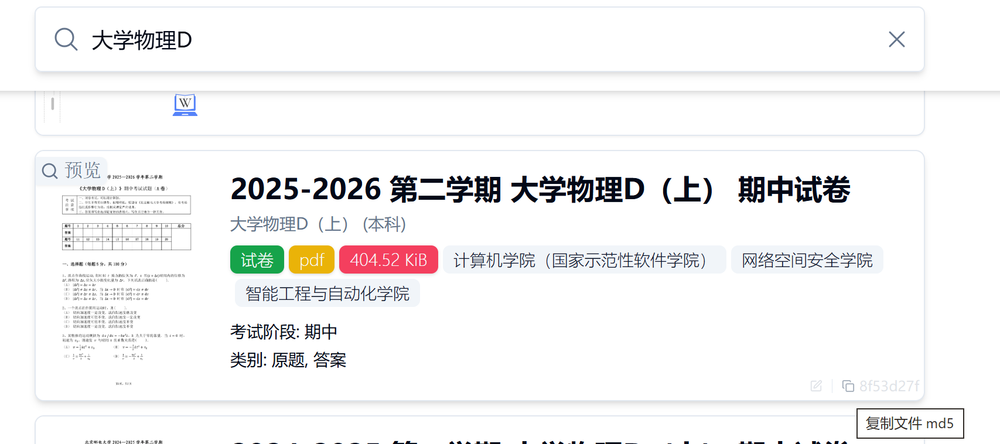

前言完成后，在下方编辑正文内容即可。

#### 方法二（依赖 VS Code 扩展）

首先点击侧边栏的 byrdocs-wiki-tool 扩展图标，点击最上方**新建页面**按扭，填写相关试卷信息。

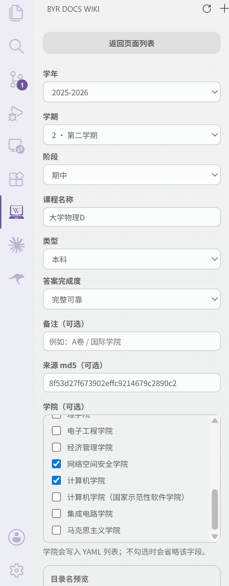

试题目录、试题文件及前言将自动生成，我们继续编辑正文内容即可。

### 预览试卷

VS Code 自带的 Markdown 编辑器无法正确渲染本项目的特定组件，我们需要使用 VS Code 插件进行预览。

在任何一份试题的 `index.mdx` 文件编辑窗口内按下 `Ctrl/Cmd + K` 再按 `V`  即可打开预览。

对于尚未打开的试卷，也可以点击侧边栏扩展图标，搜索试卷并打开编辑/預览窗口。

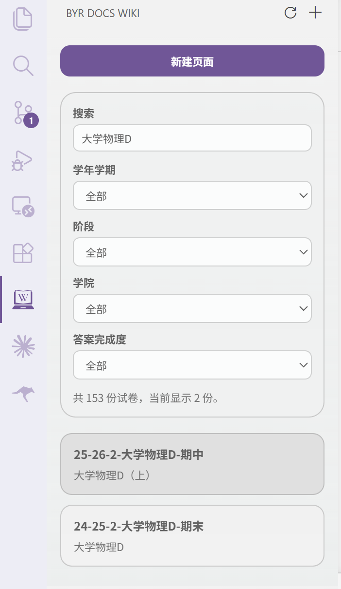

如果你使用其他编辑器，可以在终端输入**pnpm dev**启动预览服务器，再输入网址在浏览器中进行预览，例如：http://localhost:4321/exam/25-26-2-%E7%A6%BB%E6%95%A3%E6%95%B0%E5%AD%A6-%E6%9C%9F%E4%B8%AD

### 提交更改
首先，需要确保你 Fork 的仓库与上游同步。在你的仓库页面找到 `Snyc fork` 按键，如果过期请点击绿色按钮 `Update branch` 更新。

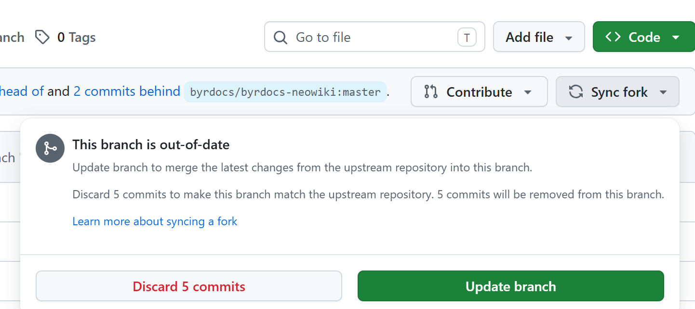

接下来同步本地仓库。点击 VS Code 左侧边栏的源代码管理，点击储存库的同步更改图标，形状是双箭头的圆环。

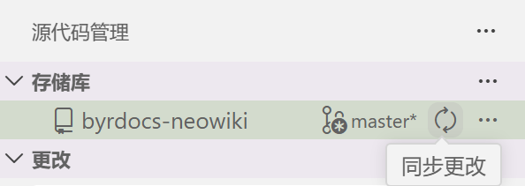

完成后点击+号暂存更改，上方输入信息后确认提交

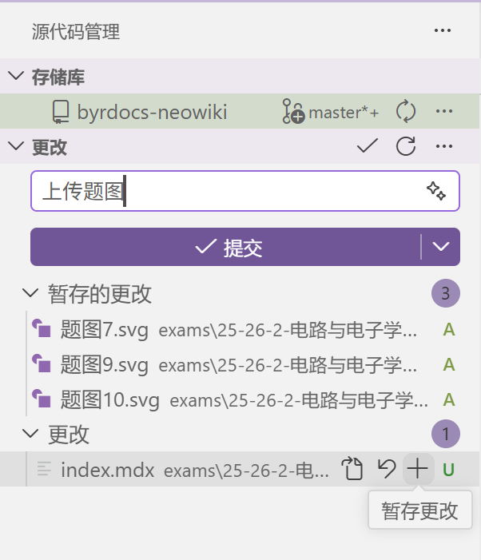

如果你使用命令行，提交更改时可以
``` bash
git pull # 从你的仓库拉取；你可能需要--rebase或--merge以处理冲突
git staus # 查看你做了哪些更改
git add . # 暂存更改(如只需要上传部分文件，替换为相应的文件/文件夹名)
git commit -m "这里写你做了什么修改" # 提交信息
git push # 推送到你的仓库
```

### 在 GitHub 上创建 Pull request
在你 Fork 的仓库找到 `Contribute` 按键，再点击绿色的 `Open pull request`。

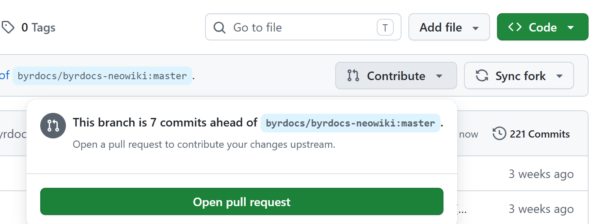

写明描述信息后点击 `Create pull request`。

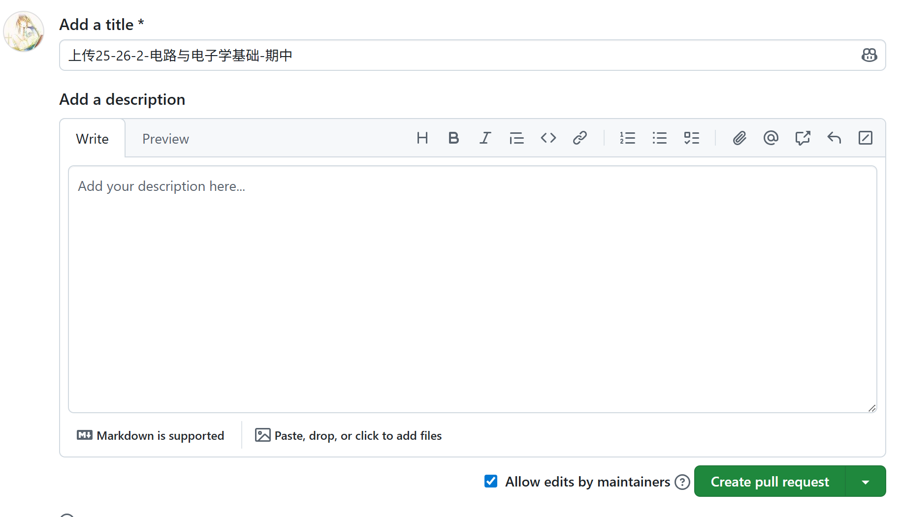

至此你已成功提交了一次修改，在该分支尚未被管理员合并之前，你在该分支提交的所有更改都会被加入该 PR，不需要重新创建 PR。

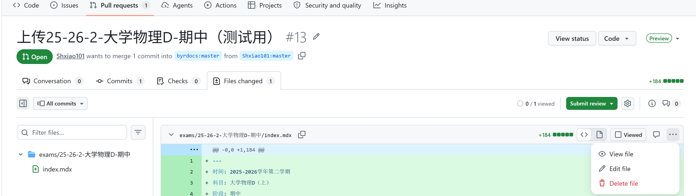

---
以上就是在维基真题整理试题文件的完整操作。

如果你有想要整理的试题文件，也可以参考以上步骤来完成。
</PostDetail>
