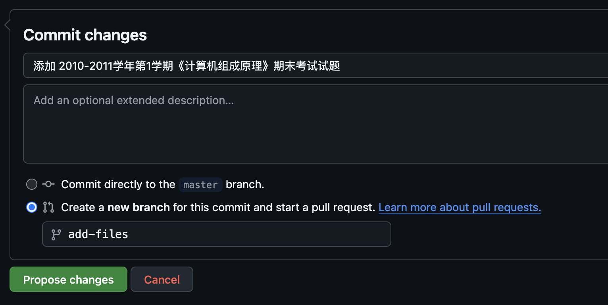

以一份「计算机组成原理」试题文件为例，介绍如何整理试题文件。

---

<PostDetail>

## 前言

以往，BYR Docs 的文件都由我一人来管理。文件的处理、上传和元信息的整理都由我一个人进行。

如果有用户希望向我们提供文件，就必须先将文件发送给我本人，再由本人上传和录入元信息。这样才能让其他人搜到。

但是，随着时间推移，我需要处理越来越多的琐事，便很少再有闲暇来逐个处理文件。本站响应用户提交文件的速度越来越慢，用户手中的文件也无法尽快上传和分享，成了迫在眉睫的问题。

以后，用户将可以通过我们提供的命令行工具（[byrdocs-cli](https://github.com/byrdocs/byrdocs-cli)）来自行上传本地文件，不必发送给我，也不必等候我漫长的处理。如果你有什么新资源想要发送给我们，只需根据我们的 [贡献指南](https://github.com/byrdocs/byrdocs-archive/blob/master/CONTRIBUTING.md) 一步步走就可以了。

当然，如果你愿意加入我们的团队，帮助我们审核和整理文件，我们也十分欢迎。更多相关资讯请移步 [周公吐哺——BYR Docs 志愿者招募](../thirsty-for-talents.md) 查看。

下面，我以一份计算机组成原理的试题文件为例，介绍如何整理试题文件。

## 准备工作

### 准备好需要上传的试题

如果你手中有需要上传的试题，请直接跳转 [使用 BYR Docs 命令行工具](#使用-byr-docs-命令行工具)。

如果你手中没有需要上传的试题，只是想帮助我们整理文件的话，那么你可以从 [待上传和整理的文件](https://github.com/orgs/byrdocs/discussions/8) 中挑选一些试题，下载到本地后再来整理。

建议在挑选试题前先浏览一下其他人的评论，以免你的整理计划与其他人重复。

当然，也建议你在有整理计划之后发送一条评论。如果整理完了，也记得把对应的目录打勾以示完成。

现在我选择了 [bupt-cs-gallery/计算机组成原理/往年题](https://github.com/faranten/bupt-cs-gallery/tree/main/%E8%AE%A1%E7%AE%97%E6%9C%BA%E7%BB%84%E6%88%90%E5%8E%9F%E7%90%86/%E5%BE%80%E5%B9%B4%E9%A2%98) 作为接下来我要整理的文件夹，所以我在讨论区发了[这条评论](https://github.com/orgs/byrdocs/discussions/8#discussioncomment-11362309)。


### 使用 BYR Docs 命令行工具

如果你有想要上传的文件，你需要通过一个名为 `byrdocs` 的命令行工具来执行上传操作，详细和最新的使用说明请参考 [byrdocs-cli](https://github.com/byrdocs/byrdocs-cli?tab=readme-ov-file#readme)。

你可以用 `pip` 或 `pipx` 来下载它，以下是我自己的用例：

```shell
# Windows Powershell
pip3 install byrdocs-cli

# Arch Linux
sudo pacman -S pipx
pipx install byrdocs-cli
```

这个工具可能会更新，所以时常升级是个好习惯。

```shell
# 注意，安装时使用哪个指令，升级时也应当使用哪个指令
pip3 upgrade byrdocs-cli # 使用 pip 来更新
pipx upgrade byrdocs-cli # 使用 pipx 来更新
```

你需要登录才可以使用文件上传功能。

```shell
byrdocs login # 输入此命令以登录
```

接下来按照引导，用浏览器打开对应的网址，再在浏览器中完成验证即可。

```shell
❯ byrdocs login
未检测到登录信息，正在请求登录...
请在浏览器中访问以下链接进行登录:
    https://byrdocs.org/auth/*/byrdocs-cli
登录成功，凭证已保存到 /home/youxam/.config/byrdocs/token
```

更多帮助请使用 `byrdocs -h` 查看。

### 处理 archive 档案库

我们的元信息存储在 [byrdocs-archive](https://github.com/byrdocs/byrdocs-archive) 中。当你向本站添加文件后，你也应当为它录入相应的元信息，再通过 Pull Request 提交到我们的仓库。

所以，你需要先把本仓库 [Fork](https://github.com/byrdocs/byrdocs-archive/fork) 到自己的账号中。对于我自己来说，就是 [cppHusky/byrdocs-archive](https://github.com/cppHusky/byrdocs-archive)。


## 文件上传

### 文件检阅

打开 [往年题/计组试卷](https://github.com/faranten/bupt-cs-gallery/blob/main/%E8%AE%A1%E7%AE%97%E6%9C%BA%E7%BB%84%E6%88%90%E5%8E%9F%E7%90%86/%E5%BE%80%E5%B9%B4%E9%A2%98/%E8%AE%A1%E7%BB%84%E8%AF%95%E5%8D%B7.pdf)，会发现，这份题目实际上是由四部分组成的：

- 北京邮电大学2010-2011学年第1学期《计算机组成原理》期末考试试题（A）
- 北京邮电大学2010-2011学年第1学期《计算机组成原理》期末考试 标准答案（A）
- 计算机组成原理试卷（B 卷） 2004.6
- 计算机组成原理（B 卷）参考答案及评分标准 2004.6

所以这份文件其实包含两套题目的原题和答案。我们必须把它拆分为两个文件。我在这里使用了 `pdftk` 命令来实现文件拆分。

```shell
pdftk 计组试卷.pdf cat 1-12 output 2010-2011-计组试卷.pdf
```

> 还有一些类似情况需要处理，比如说，如果你发现有两份文件，其中一份是试题，而另一份是相应的答案，那么你完全可以考虑把它们合并成同一个PDF，这样也更方便其他人搜索下载。

而那份 2004 年的题目实在太古老了，不值得上传，我就不要它了。

> 有些题目过于古老（超过15年），参考价值有限，我们一般不建议上传；除非这门课程可用的试题太少，只能拿较老的题来作为参考。

### 避免重复

在你上传文件之前，最好先在 [byrdocs.org](https://byrdocs.org) 中搜索一下有没有同样的试题，以免重复。

我搜索 `2010-2011 计算机 组成` 字样后，发现没有 2010-2011 年的计组试卷，说明没有重复，于是就可以正常上传了。

### 通过 `byrdocs` 指令上传

接下来，我们通过 `byrdocs` 指令来上传此文件。

```shell
> byrdocs upload 2010-2011-计组试卷.pdf
Uploading: 100%|████████████████████████████████| 8.60M/8.60M [00:06<00:00, 1.26MB/s]
文件上传成功！
    文件地址: https://byrdocs.org/files/8986bcea504b391963c325a0e43bdc59.pdf
? 是否立即为该文件录入元信息？ (Y/n)
```

出现这样的信息就代表上传成功了。

命令行工具还询问我们是否进行元信息录入，如果你想顺便录入此元信息，按下 `Enter` 键即可。

### 如果在上传的时候显示 `文件已存在`

首先，你可能忘了[查重](#避免重复)。

另外，有可能其他人上传了文件，但使用了不规范的名字，导致你没有查到。

> 你可以通过搜索这个文件的 md5sum 来查看站内是否有这个文件，并确认其命名是否规范。如果发现命名不规范，你可以修改它。
>
> 下图是我在已经发布后搜索这个文件的结果：
>
> 

当然还有一种可能，也有其他人在试图上传这个文件，并且比你快了一步。这时建议你暂缓上传。

## 录入元信息

有两种方式可以录入元信息：直接填写 .yml 文件，或者通过 `byrdocs` 辅助填写。

直接填写请参考 [关于文件/文件元信息](https://github.com/byrdocs/byrdocs-archive/wiki/%E5%85%B3%E4%BA%8E%E6%96%87%E4%BB%B6#%E6%96%87%E4%BB%B6%E5%85%83%E4%BF%A1%E6%81%AF) 中的指引进行，这里不做赘述。

接下来我们使用 `byrdocs` 指令的辅助填写来完成这项工作。

### 类型

当然是「试题」。


### 学院

试题中没有直接透露本门试卷是什么学院的。如果没有其他辅助信息可以帮我们辨别的话，这段应该不填。（原则，宁缺勿滥）

但所幸，这个试题的 [来源仓库](https://github.com/faranten/bupt-cs-gallery) 本身是收集计算机学院资源的，所以我们至少知道它是计算机学院的试题。

我们填写上计算机学院的全称（`计算机学院（国家示范性软件学院）`），这里可以使用 TAB 进行自动补全。


注意，一个试卷有可能在多个学院进行考试，所以这里可以填写多个学院，每行输入一个学院即可。

按 ESC + Enter 提交并继续。

### 学段

我们不太清楚这是本科试题还是研究生试题，但是根据仓库的描述，我们估计它是本科生的内容。

这种估计不算是很强的证据，所以我们可填可不填。我本人一般不填（填为「未知」。


### 课程

一目了然，这门课程的名字当然是《计算机组成原理》。


### 学年

这份试卷的信息记载比较详细，我们可以看出它的起始年为 2010，结束年为 2011，学期为第一学期，是期末考试。

> - 如果不知道是期中还是期末考试，填「未知」。
> - 如果不知道是哪个学期的考试，填「未知」。
> - 如果试卷上只写了一个年份，没有其他信息（比如，2020年），那么起始年、结束年都填写为 2020，学期填「未知」。
> - 但是，如果你有任何线索可以辅助自己判断考试时间，那就可以细化一下。比如，若试卷上标注了 2004年6月，那就可以合理猜想，这份试卷是 2003-2004 学年第二学期的期末试题。


### 文件内容类型

这份试卷包含了原题和答案，所以我们使用空格选择上「原题」和「答案」然后按回车。


## 提交

确认信息无误后，你就可以提交了。

接下来我们会看到一个 .yml 格式的文件，它的内容是

```yaml
# yaml-language-server: $schema=https://byrdocs.org/schema/test.yaml

id: 8986bcea504b391963c325a0e43bdc59
url: https://byrdocs.org/files/8986bcea504b391963c325a0e43bdc59.pdf
type: test
data:
  college:
    - 计算机学院（国家示范性软件学院）
  course:
    name: 计算机组成原理
  time:
    start: '2010'
    end: '2011'
    semester: First
    stage: 期末
  filetype: pdf
  content:
    - 原题
    - 答案
```

注意，文件开头的注释 `# yaml-language-server: $schema=https://byrdocs.org/schema/test.yaml` 是为了给直接使用编辑器编辑元信息的人提供自动补全和格式校验功能的，请不要删除。

## 将元信息推送至 archive

当我们 Fork 好自己的仓库之后，应当先在自己的仓库中修改好元信息，再提 Pull Request。

我们可以在 GitHub 网站上直接添加文件或修改元信息，也可以通过 Git 在本地仓库内进行编辑，再推送到 GitHub 的仓库中。

如果你对 Git 操作比较熟悉，我们强烈推荐你使用第二种方法。不会也没关系，这里我以第一种方法为例来讲解。

1. 首先，通过 `Sync fork` 与主仓库同步。
    
2. 打开 `metadata` 目录，点击 `Add file`->`Upload files`。
    
3. 上传 .yml 文件（注意，不要上传 PDF！你应当上传的是元信息文件）。
4. 建议在 `Commit Changes` 之前简单地说明一下你做了什么。比如，我在这里填写的是 `添加 2010-2011学年第1学期《计算机组成原理》期末考试试题`。
    
5. commit 之后，再点击 `Contribute`->`Open pull request`->`Create pull request`。
    
    如果有额外的信息，可以在创建 PR 的时候补充。
    
6. PR 创建之后，会自动触发 check，检查元信息格式是否正确、文件是否存在等等。如果没有问题，维护者会合并你的 PR，这份试题就可以在 [byrdocs.org](https://byrdocs.org) 上搜索到了。如果 check 失败，请检查日志中的 `Check` 一项，查看具体错误信息，然后在自己 Fork 的仓库中进行修改，会自动再次运行 check。

---

以上就是整理试题文件的完整操作。

如果你有想要整理的试题文件，也可以参考这些步骤来完成。

</PostDetail>
