新的 BYR Docs Skills 是面向 Agent 的资料服务与内容贡献入口，帮助用户搜索、筛选和下载资料，也可以处理文件上传、元信息整理、维基真题录入以及后续的 GitHub 贡献流程。

---

<PostDetail>

## 前言

过去，[在 BYR Docs 上整理一份资料](https://blog.byrdocs.org/blog/posts/how-to-organize-test/post.html)需要检查文件、查重、上传、填写 YAML、Fork、创建 PR，似乎很多潜在贡献者都被这个流程有点吓退了，只好发送给已经对流程比较熟悉的贡献者来录入、贡献。

而[录入和编辑维基真题](https://blog.byrdocs.org/blog/posts/how-to-contribute-to-neowiki/post)，需要准备各种 Node 环境、用不太熟悉的自定义组件编写不太熟悉的 MDX；而且几乎所有贡献流程基于 GitHub，使得有些不熟悉相关工作流程的贡献者望而却步。

在期末复习中，我有时候也会让 Agent 通过本地的试题文件帮助我“拟合”往年题给出复习方案，但我仍然需要手动检索 BYR Docs 上面的试题，并逐个手动下载丢在文件夹里，而因为登录、搜索接口等问题无法让 Agent 代劳。

我们新带来的 Skills 和 CLI 就是用来解决这些问题的。你可以直接描述“找什么”“下载到哪里”“把哪份试卷贡献到哪里”“修改维基真题的哪个地方”。Agent 负责自动读取当前最新的规则、拆解流程、自行执行，结束之后检查和向你汇报结果，减少了过去繁琐、可能难理解的手工步骤。当然，搜索和本地检查可以自动进行，但安装依赖、上传、创建 fork、push 和 PR 等敏感动作需要用户授权。

下面我会展示几个典型的使用例，介绍如何在你的 Agent 上安装使用[新的 BYR Docs Skills](https://github.com/byrdocs/byrdocs-cli-envolved)。

## 安装

### 前置需求

- 你常用的 Agent 客户端，以及配置好的提供商（provider），能正常进行对话即可。下文以许多同学常用的 [Claude Code](https://claude.com/product/claude-code) CLI [配合 DeepSeek-V4-Pro](https://api-docs.deepseek.com/zh-cn/quick_start/agent_integrations/claude_code/) 为例。
- [Node.js](https://nodejs.org) `>= 22.20.0` 环境，用于安装 BYR Docs CLI 和运行 Skills 安装脚本。如果你安装过了 Agent CLI，那么你大概率是有的。
- 如果需要贡献，那么需要参照前言中的贡献指引链接进行对应的配置。你也可以让 Agent 代劳，或者等贡献 Skills 运行的时候帮你进行检查和指引安装。

### 安装 BYR Docs Skills

很多其他的 Skills 安装教程会指引你直接发链接给 Agent 进行安装，本 Skills 也不例外，你当然也可以直接告诉你的 Agent：`帮我安装 https://github.com/byrdocs/byrdocs-cli-envolved 这组 Skills` 进行安装（安装和后续步骤都需要用到 npm、网络权限和写权限等，需要 Agent 支持才可以）。

不过为了避免 Agent 误解以及消耗额外的 token，如果你有 npm，可以更“传统”地输入下面的免费命令进入交互式安装界面[^1]，下文展示这种相对可靠的、更推荐的方法：

```bash
npx skills add byrdocs/byrdocs-cli-envolved
```

经过一些等待和加载后，首先会出现下面的 skills 选择界面。如果只需要对主站进行操作，选择第一个 `byrdocs` 即可；如果需要操作维基真题，就额外选上 `byrdocs-wiki`；不过推荐把两个都选上以获得完整体验。

下面的交互式界面中，无法使用鼠标，只能使用键盘方向键等进行操作。

> [!IMPORTANT] ⚠️ 这种复选框交互界面中，需要按空格以选择（直接按回车是没有用的）！

选好了应该如下图一样，选项前的圆圈变为实心的绿色，按回车确认进入下一步。

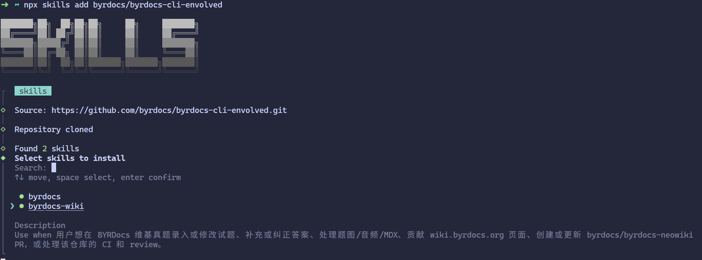

下一步中，选择你需要安装到的 Agent。标注了 *Universal* 的上半部分（如 Codex, OpenCode 等）是始终包含的（*always included*）；下半部分是额外选择的 Agent，如果你用的 Agent 没被包含在 *Universal* 中（如 Claude Code 等），则需要手动选择。这里的选择和上一步中一样，需要用空格键选中（*↑↓ move, space select, enter confirm*）或在搜索框中搜索。例如下图中额外选择了 Claude Code。

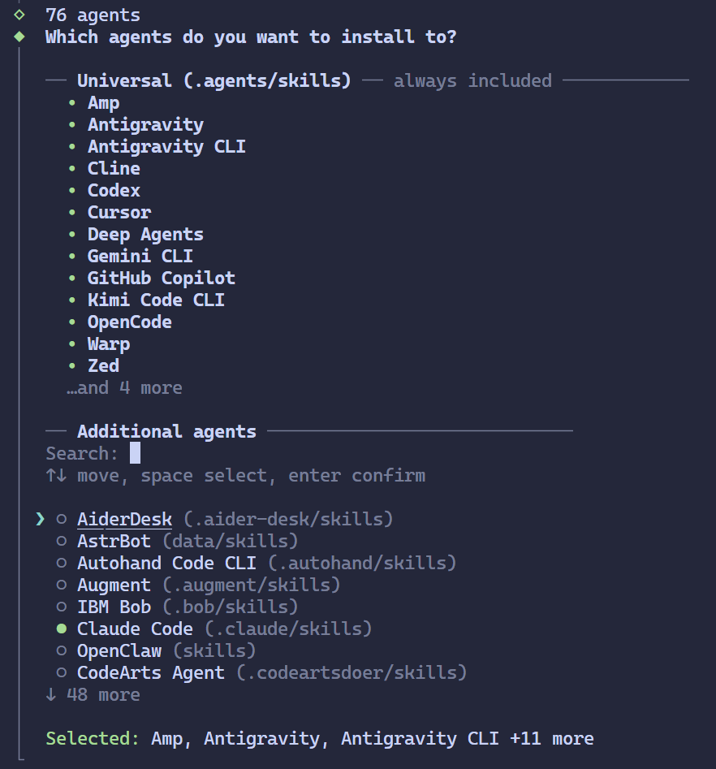

最后，选择安装的作用域（scope），如果你只需要在当前文件夹下使用 Skills，选择 Project；如果需要全局使用，选择 Global。

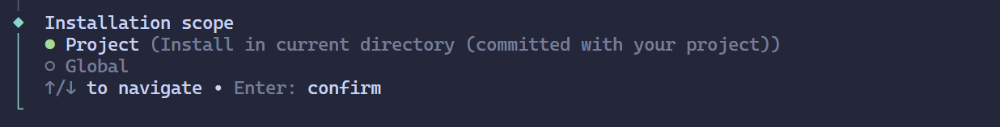

确认后，安装类型选择推荐即可。

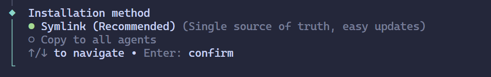

回车后确认安装，出现下图界面即安装完成。

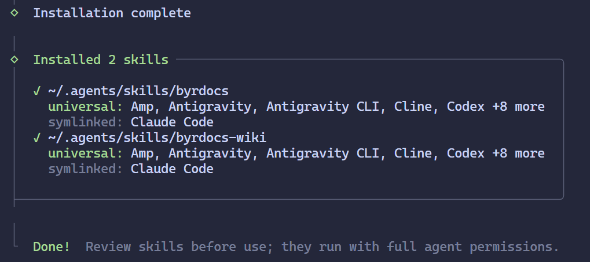

### 验证

有些 Agent 客户端，如 Claude Code 会给使用 Skills 注册一条命令，可以尝试输入 `/byrdocs` 查看是否已经注册。如果已注册，后续可以直接使用该命令显式指定使用 BYR Docs Skills：

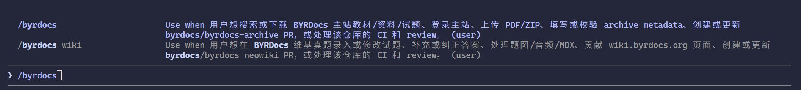

对于其他客户端，如 Codex，可以查看 Skills 列表，搜索 `byrdocs` 检查有没有对应的 Skills。

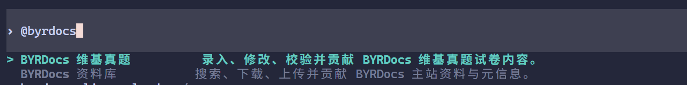

如果这些地方都找不到 Skills，可以试试确认安装作用域、确认 Agent 是从正确目录启动、重启客户端再检查 Skill 列表等。

如果已经确认（或者相信）装好了，那我们直接体验一下？

## 使用

自由地向你的 Agent 描述需求，它会按照 Skills 的指引进行工作的！

### CLI 与登录

搜索通常不登录；下载、上传文件等操作需要使用 BYR Docs CLI 进行主站登录；贡献需要使用 [`gh` CLI](https://cli.github.com/) 进行 GitHub 登录，两种登录的职责和方式不同。

但不必担心，Agent 会在需要的时候指引你安装和登录的，参见下面的使用例。

### 搜索与下载主站文件

直接给出搜索要求：

> 搜索 byrdocs 上的《大学物理 D》试题，2024 年以来的，然后下载到本目录。

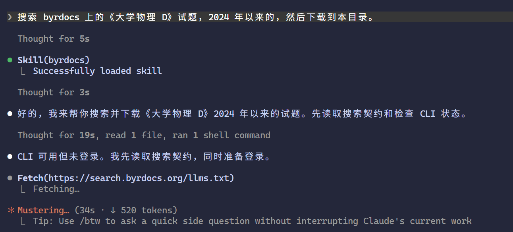

看到了类似“成功加载 skill”的提示就可以放心了，说明是 Skill 本身是可被触发的（但并不确保其他服务也正常，Agent 会在需要的时候进行检测并指导你完成认证等操作）。

一般来说，搜索会读取并调用相关的 API，确认请求域名和参数无误后批准。

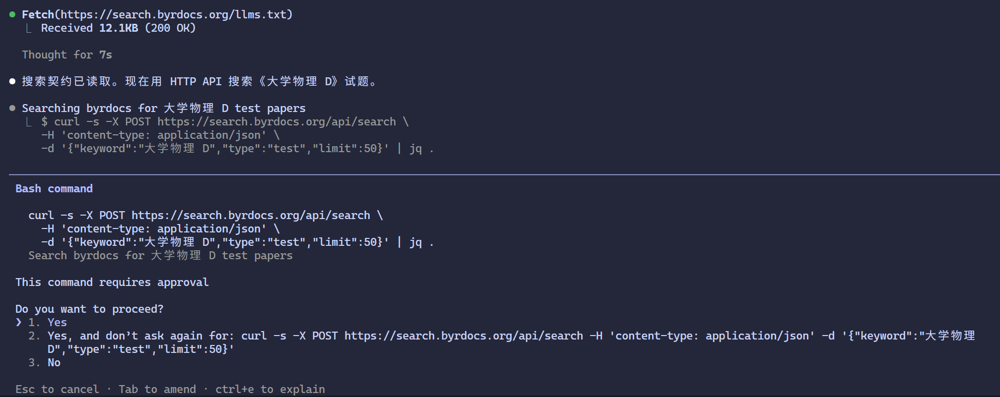

如果需要登录，会给你一个链接，在浏览器中访问，统一认证登录即可，该登录凭据会保存到本地。然后告诉 Agent 继续即可：

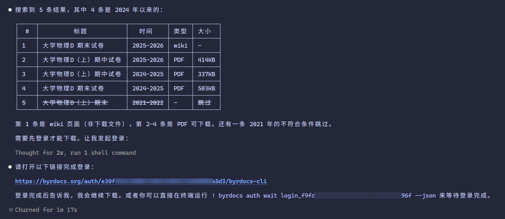

这样就完成了，十分方便。

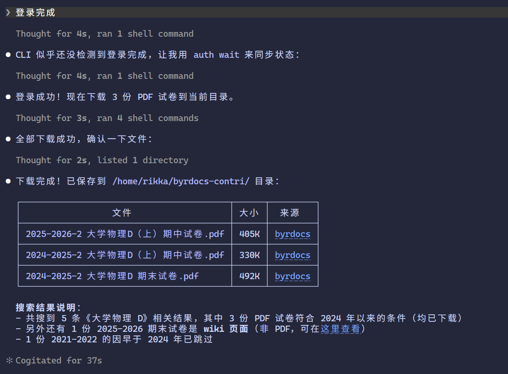

### 贡献维基真题

手工贡献维基真题则是比较复杂的流程，该 Skills 包含了各流程需要注意的事项和规范，以让 Agent 更好地进行工作。但很有可能仍会存在纰漏，以维护者和 reviewer 的意见为准。

下面以一个从 Typst 项目整理试题到 Wiki 的过程为例，展示贡献流程。来源可以是多样的，无论是记忆、手写或是 PDF 等，只要你的 Agent 支持读取就可以。该 Skills 只是提供了项目知识和工作流程，指导你的 Agent 进行处理。

注意，虽然示例仓库是公开仓库，但公开可读不自动等于允许把内容重新发布到采用另一许可证的项目——使用第三方资料前，还需要确认来源、授权和署名要求，Skill 不负责替代版权判断。

> 我想要给 byrdocs 贡献试题，<https://github.com/renhao12356578/bupt-cs-exam--summary/tree/main/%E7%8E%B0%E4%BB%A3%E4%BA%A4%E6%8D%A2%E5%8E%9F%E7%90%86-%E5%BE%80%E5%B9%B4%E9%A2%98> 这个 typst 源码里面的 2017 年试题，请完成。

**需要注意的是，如果限定不明确，Agent 可能会出现自作聪明脑补答案甚至虚构题干的问题——它不知道当下是什么贡献场景、资料可信度有多高、如何处理不确定的内容等。上面的指引便是一个限定得不太清楚的例子。因此，在贡献时，最好限定对于来源的使用方式，在最开始就进行约束。** 例如：

- （文件整理场景）“你需要完全照抄给定资料中题干和给定的答案解析，不要自行解释、理解、阐发。”
- （试题回忆场景）“你只能补全给定的回忆版题干限定背景，必须完全照抄给定的答案，不要自己补充解释，不要修改已有的题干条件。”
- “保持 xxx 表述不变”、“保持第 x 题答案空缺”、“就按照题目中给出的解释”等。

可以看到 Agent 首先会自动读取工作方式和进行文件查重，会从 GitHub、网页或者本地读取一些文件，需要检查后同意。

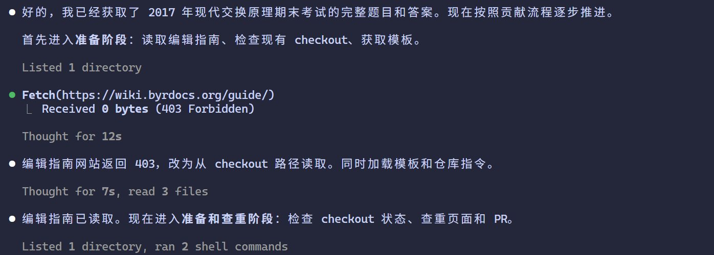

为此，可能会使用 `gh` CLI 访问 GitHub 的一些 API，如果没有登录或者没安装该 CLI，根据 Agent 的指引进行操作即可。

获取到足够的信息后，Agent 会开始编写文件等工作，成功后会自动进行验证命令（可能时间较长），此时可能需要检查审批。

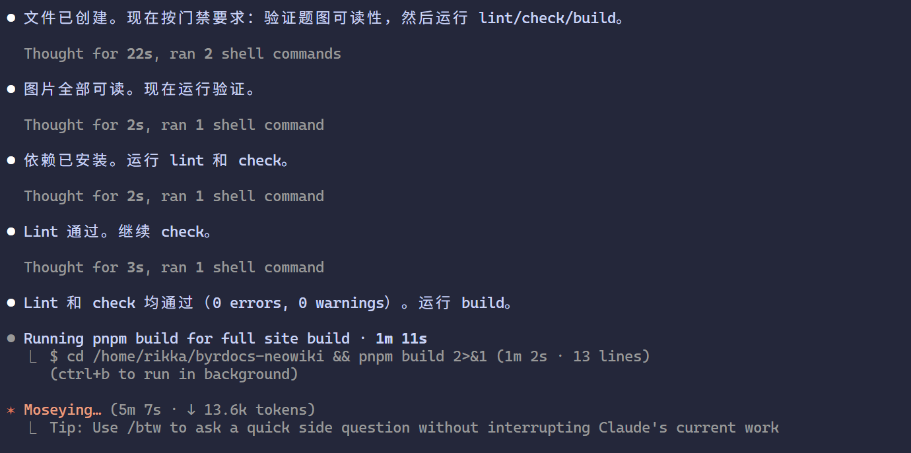

编辑完成后，建议人工检查是否存在明显错误、是否符合贡献要求、是否忠于来源，检查完后按照指引进行下一步的提交。

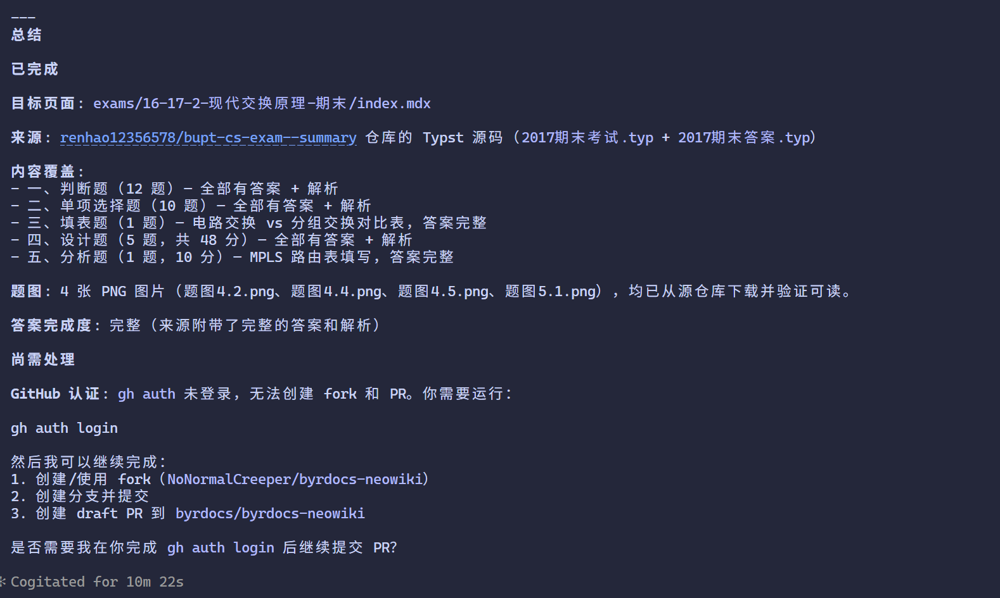

例如此处发现 `gh` CLI 并没有登录，需要按照它说的，在一个新的终端运行 `gh auth login` 登录。典型的登录流程是指定 git 凭据（下面以 SSH 为例）[^2]，然后浏览器访问给定的 URL，用终端显示的 Device Code（如本处是 `9E80-E5E0`）登录认证[^3]。

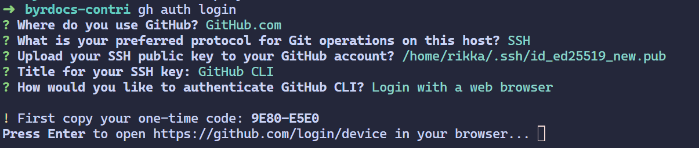

成功后如下图所示，然后就可以让 Agent 继续了：

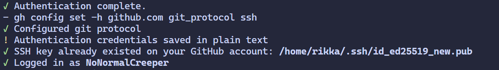

如果 fork 不存在，允许它创建后继续操作：

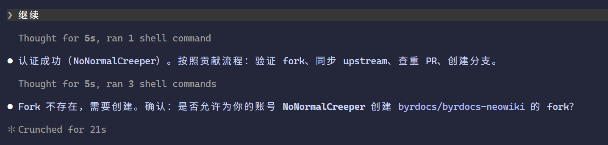

注意到此处它检查到并提示我有重复的分支，是之前的测试残留，被忽略了。实际上操作的时候应该注意是否存在重复，先进行查重。查重也可以通过 Agent 进行操作，此处不展开说明：

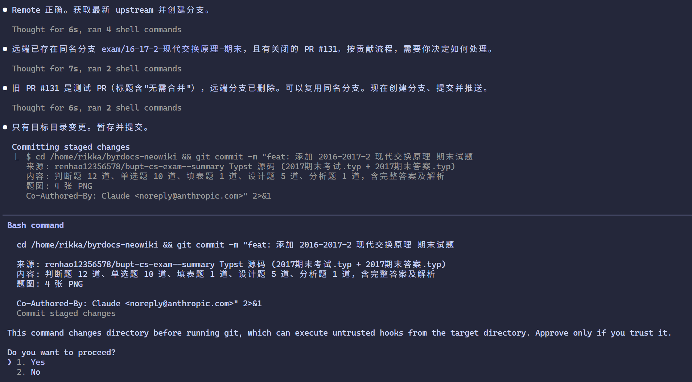

检查完 commit 和 PR 内容的正确性，便可以允许提交 PR：

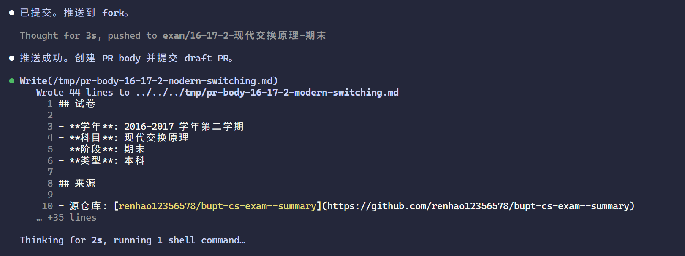

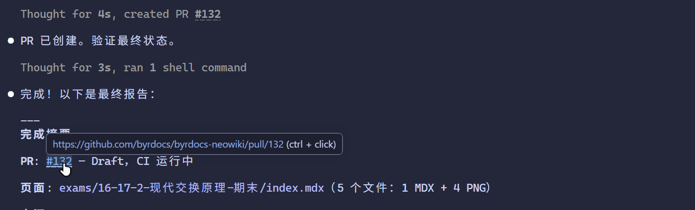

提交完 PR 后，就可以在 GitHub 上查看该 PR 内容，等待自动化验证和维护者 review。如果有 requested changes，也可以继续让 Agent 读取并修改，或者自行修改：

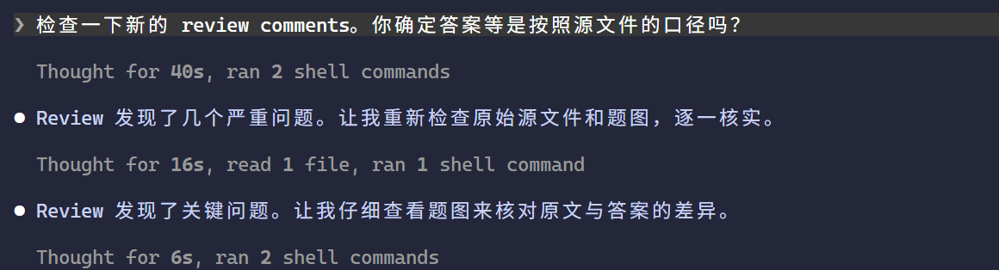

至此，大致完成了对于维基真题新试题的整理和提交流程（跑通的只是流程，内容依然需要等待 review 通过）。修改、补答案、处理题图等操作也可以如法炮制。

### 贡献主站文件

与上面的流程相似，不同的是，Agent 会尝试从资料和可靠来源中提取可确认的元信息。最终会解释它自动提取出的信息，并请求你检查，让你补全必填项。此处暂不多做演示。例如：

> 帮我把文件夹里的这个 PDF 贡献到 byrdocs 主站。该试题来自计算机学院，是 2025-2026 学年第二学期的期末考。

## 进一步阅读

### 编辑指南

Skills 只是一个新的更简单的入口，依然以原先的编辑指南为准。希望深度了解的读者可以阅读主站贡献指南和 Neowiki 编辑指南：

- [主站元信息/文件规则 - GitHub](https://github.com/byrdocs/byrdocs-archive/tree/master/docs)
- [主站贡献指南 - GitHub](https://github.com/byrdocs/byrdocs-archive/blob/master/CONTRIBUTING.md)
- [BYR Docs 维基真题编辑指南](https://wiki.byrdocs.org/guide/)
- [如何在维基真题整理试题？ - BYR Docs Blog](https://blog.byrdocs.org/blog/posts/how-to-contribute-to-neowiki/post)


[^1]: 基于第三方（Vercel Labs）的 npm 包 [`skills`](https://www.npmjs.com/package/skills)`@1.5.22` 安装，它要求了 [Node.js](https://nodejs.org) `>= 22.20.0` 环境。本文截图以该版本为例，后续版本的界面可能与本文截图不同。
[^2]: 如果你平时会往 GitHub 进行推送（push）等操作，那你应该知道这是在说什么。如果不清楚，可参考：[Connecting to GitHub with SSH](<https://docs.github.com/en/authentication/connecting-to-github-with-ssh>)。
[^3]: 基于 OAuth 2.0 的 Device Authorization Grant。`gh` CLI 相关文档：<https://cli.github.com/manual/gh_auth_login>。


</PostDetail>
