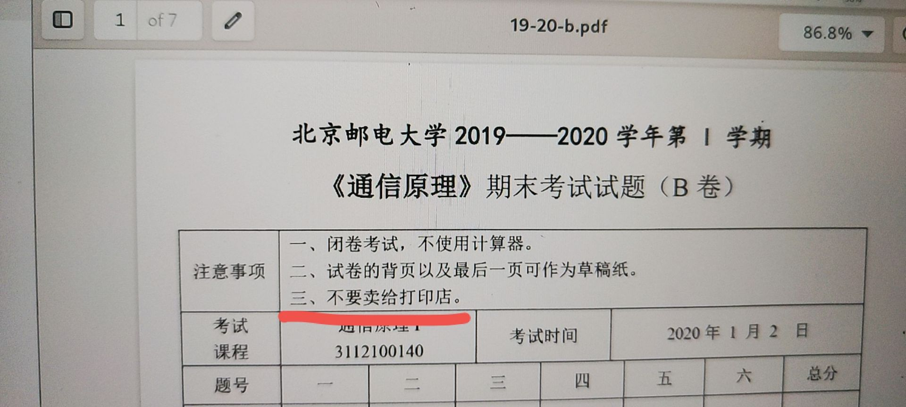
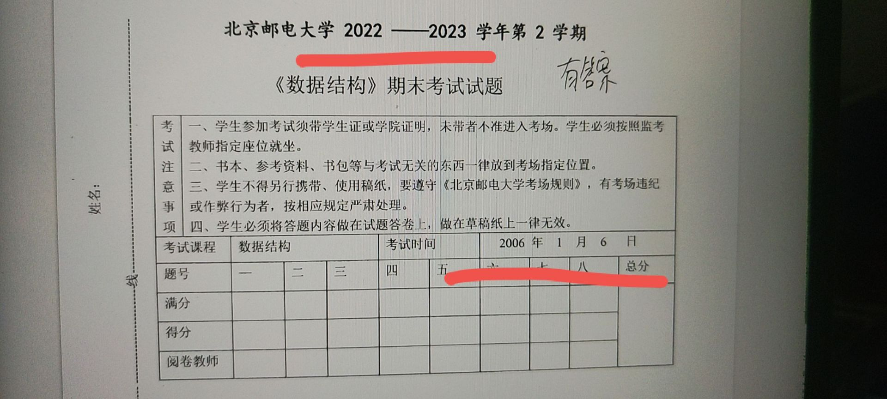
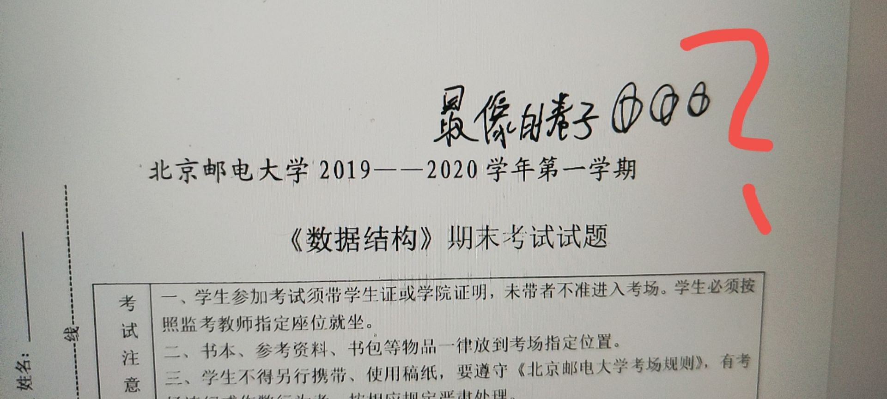
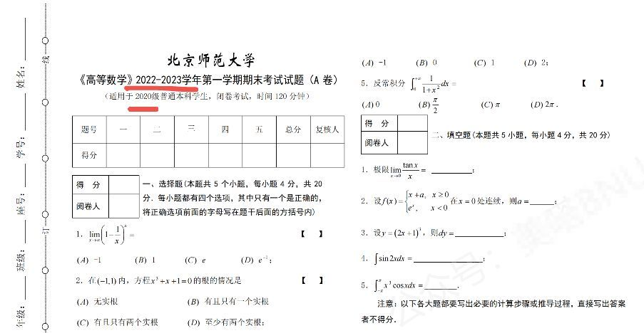

上一代试题整理人已经远去；

是时候由我们这一代人来接力了。

---

<PostDetail>

## 时来天地皆同力

大概在 2020 年以前吧，收集、整理试卷曾经是一个易如反掌的事情。

那时候试题保密工作还没有现在这样严格，学生们很容易把卷子带出来，或者从老师手中拿到往年题的电子版。

打印店便看准了这个机会，从学生手中收购试卷，再加以整理、印制、装订，售卖给下一届学生。

老师们就在卷子上特别叮嘱，不要把试题卖给打印店。但是效果如何，想必不用我多作说明了。

## 无可奈何花落去

然而这样的好时代一去不复回了。

疫情之后的这几年里，考后清点试卷的要求越来越严格了；愿意把往年题发出来的老师也越来越少了[^2]。

打印店倒没有那么窘迫，他们只需要继续卖他们五年前、十年前拿到的题目，间或加上一点能搞到的近年题就行了。

可是对于大部分科目来说，这些古老的题目又能有多少参考价值呢？

## 假作真时真亦假

打印店题目最可怕的地方还不在于时效性差，而在于用一些真假难辨的「真题」以次充好。

如果说这份卷子是2022-2023年的试题，那么下面「考试时间」中标注的2006年是怎么回事？

这份卷子里写的「最像的卷子」又是什么意思？

无独有偶，其它学校也普遍存在这类假冒伪劣真题。它的字体错误，时间错误，题目难度显著不正常，破绽实在太多，所以才很容易被人戳穿。

「假题」多了之后，我也就很难再对他们的「真题」给予信任了。谁能知道它是真是假呢？

## 沉舟侧畔千帆过

抛开打印店不谈，也有学生在自发地整理复习资料（包括试题）并分享给下一代。在这方面，BYR Docs 并不是第一个。

我曾收到各种不同来源的资料。有些资料附着一份 README，写着自己的名字、网站（已经打不开了），还可能带着一两句祝福语。

也有些资料把自己的网站直接印在PDF的页眉/页脚——当然，这些网站也都已经打不开了。

他们的整理工作未必做得很好。有些文件连名字也不改，就直接发布到网上了。

但我们正是靠着这些遗产白手起家，把 BYR Docs 搭建了起来。前人的遗志就由我们来继承。

## 运去英雄不自由

上一个时代的人们有机会拿到大量真题，可惜疏于整理。他们离开了，残存的文件便落入一群不负责任的人手中，被编成劣质的装订本，卖给下一代的学生。

如今我要把试题整理的工作做起来，却苦于没有多少近年试题可用，只能先整理那些五年开外、十年开外，甚至年代更加久远的残羹冷炙[^1]。

可是这些质量参差不齐，时效性差，而且未必有答案的试卷，真的能帮到谁吗？

我越是整理试题，便越是觉得收集整理近年题势在必行。

然而越是摸索尝试，便越是觉得举步维艰。

大环境就是这样——我不可能从考场把卷子带出来，也不可能从老师口中把题目翘出来。空有一腔抱负，却无半点作为，又能改变什么呢？

## 柳暗花明又一村

不过，我们还不必如此悲观。

在 BYR Docs 创立的半年多里，我陆续收到了很多同学给我发送的近年试题。

我也尽我所能，为其中一部分题目编撰了答案。

后来我们对用户开放了上传文件的权限，又开设了「维基真题」，希望可以增加人手，进一步规范试题的整理工作，并优化试题的使用方式。

仅凭我一个人确实改变不了什么；但是一群人可以。

现在我们正在步入这条轨道。希望大家愿意与我同行。

## 风物长宜放眼量

总有一天我也会毕业，我无法保证 BYR Docs 后继有人。

或许我们也会像上一代人开设的站点那样，随着负责人毕业而关停。

但是我相信，薪尽火传，BYR Docs 之后一定还会有新的站点出现，也会有人比我们做得更好、更长久。

但愿到了病树前头万木春的时候，还有人能把好消息带给我这颗沧海一粟。

---

[^1]: 我看到过最久远的卷子是一份1998年的试题，可惜当时就给删除了，没有留作纪念。

[^2]: 根据我们的经验，能在考试当学期拿到的试题（包含期中、期末）只有廖廖几份；能在一年后拿到的试题也只有二三十份，并不算多。

</PostDetail>
