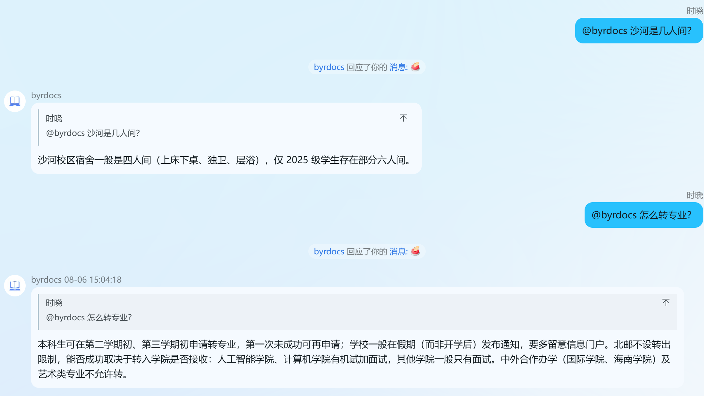
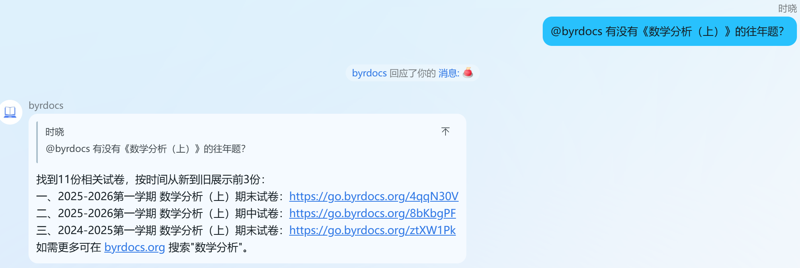
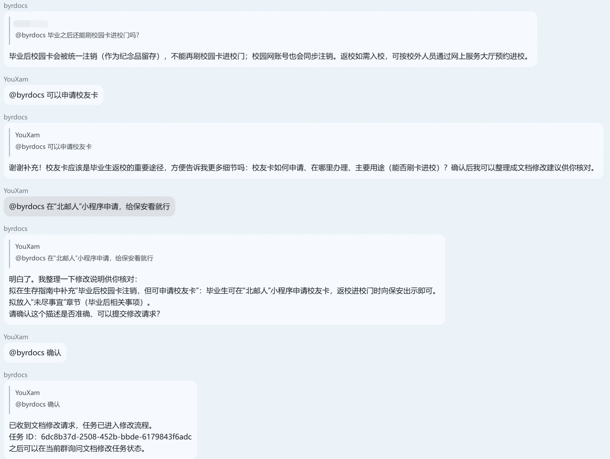

我们把 BYR Docs 主站和 BUPT 生存指南接入了 QQ 群的 bot。现在你可以在群里询问学校生活、查找教材资料，也可以更方便地给生存指南提交修改。

---

<PostDetail>

## 起因

“新生宿舍是几人间？”

“有没有 XX 课的往年题？”

每逢新生入学或考试临近，类似的问题总会在群聊里反复出现。热心的同学当然会来解答，可是一段聊天记录很快就会被新消息淹没，等到下一位同学遇到相同的问题时也许就无法得到及时的回答。

其实，这些问题中的许多都已经有了答案。[BUPT 生存指南](https://guide.byrdocs.org)整理了住宿、餐饮、交通和校园办事等信息；[BYR Docs](https://byrdocs.org)则收集了电子书、试题和其它学习资料。遗憾的是，并非所有人都知道应该去哪里查找；即便知道，也未必有意愿主动从网站中找到自己需要的内容。

既然大家更习惯在群聊里提出问题，于是，我们做了一个 byrdocs 问答机器人，并将它投入北邮新生群和工具人群等 QQ 群中使用。

## byrdocs 机器人

### 询问校园生活

如果你有任何疑惑，可以直接 `@` 机器人提问。无论是沙河、海淀校区的学习生活，还是住宿、餐饮、校园网、就医、军训和转专业等问题，它都会先查找生存指南中的相关内容，再根据你的问题组织回答。如果手册尚未覆盖有关信息，它会尽量查找学校官网；仍然没有找到时，则会直接说明。

当然，有些同学并不知道群里有这样一个机器人，也就不会特意 `@` 它。因此，我们接入了 LLM 让机器人判断群聊中的普通消息是否在询问生存指南能够回答的问题。当它认为该消息属于提问时，便会主动回答。

### 查找教材和资料

除了问题咨询之外，你也可以让机器人帮忙检索 BYR Docs 主站上的教材、试卷和其他资料。

### 更新生存指南

校园生活信息也会随着设施、规定和办事流程的变化而逐渐过时，如果机器人一直重复旧答案反而更容易误导他人，好在群聊中若有了解情况的同学看见了可以指出错误并纠正。

另一方面，在群聊中，经常有人掌握最新的一手信息。例如有人刚刚办完某项手续，有人发现食堂营业时间已经调整，也有人亲自走访过生存指南尚未记录的地方。可惜这些消息仍然很容易沉入聊天记录，未必能被下一位需要它的人看到。

而现在，如果你发现生存指南缺少内容，或者其中的信息已经过时，可以直接在群里告诉机器人。它会根据你的描述整理修改内容，并向生存指南的 github 仓库提交一份 Pull Request。

维护者仍会人工核实修改内容，确认准确无误之后，这份 Pull Request 才会被合并到生存指南中。更新后的内容不仅会帮助网站上的读者，也会成为机器人今后回答问题的依据。

---

如果你所在的群聊已经接入 byrdocs 机器人，欢迎向它提问，让它帮你查找教材和资料。

如果你发现生存指南中有任何错漏，也欢迎直接告诉它。

当然，你仍然可以直接访问 [BYR Docs 主站](https://byrdocs.org)查找资料，或前往 [BUPT 生存指南](https://guide.byrdocs.org)阅读和贡献内容。

</PostDetail>
