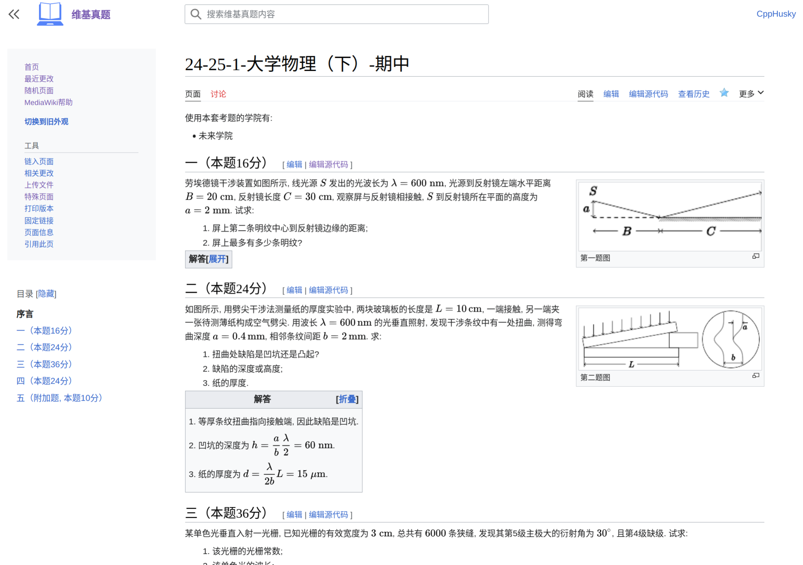

我们计划建设一个「共享题库」。

请认准我们的网址：[wiki.byrdocs.org](https://wiki.byrdocs.org)。

---

<PostDetail>

## 起因

不久前我参加了一次期中考试。老实说，考前基本没复习，只能硬着头皮上。

一个多小时过去了，看着旁边的同学们一个个提前交卷走人，我越发感到坐立不安。

其实我也做完了，但我在想另一件事——怎么把试题偷出来。

### 我们的试题来自哪？

除了各级学生们代代相传的上古试题以外，BYR Docs 一直都在想办法收集近年题。

因为近年题的保密要求比较严，所以我们获取题目的难度尤其高。

但也有人通过种种不为人知的方法搞到了题目并发给我们。其中最为瞩目的方法就是——直接把题目背下来。

对于一些阅读量比较小的试卷来说，这种方法还蛮有用的，所以我就萌生了一个想法：我也来背背题目。

可惜我记忆力太差了，恋恋不舍地把卷子交上去之后，刚出考场就把背下来的题给忘了。

### 我们的试题也缺少答案

仅仅有试卷原题还不够。多数时候我们还需要题目的答案，否则我们也不知道这题做得对不对。

但问题在于，我们拿到试题已经十分困难，再想拿到官方的答案就更不可能了。

我曾经开设过一个[考题补完计划](https://github.com/byrdocs/byrdocs-completion)来补充答案，但绝大多数时候都是我自己在编答案。我的能力有限，时间也有限，不可能逐份编答案，更不能保证正确率。

所以我们也需要一些协作手段。如果其他人发现我们的试题缺少答案，他可以来填写；如果做题时发现答案有问题，也可以来修改。

综合以上需求，我觉得，我们的最佳选择是**建设一个能够共同编辑试题内容的维基站点**。

## 维基真题

[维基真题](https://wiki.byrdocs.org)使用 MediaWiki 构建，是一个开放[^1]、共建、共享的维基网站。

我们计划把近年试题以 wikitext 文本的形式录入到网站当中，效果如图所示：

当然，这是一份「完整」的试题和答案。实际情况下我们很难得到一份完整的试卷，那么我们可以怎么做呢？

### 题目回忆及录入

假设你刚考完试，头脑中还对刚才的题目有一些残存的印象。

这时你就可以趁着还没忘，尽快把题目录入到维基中。

即便你不能准确记得题目原文，那也没关系，只要能把题意描述清楚即可。（某种意义上讲，清晰地描述题意比准确地还原原文更重要）

如果你有办法搞到原题[^2]，也可以直接对照原题内容录入。

### 答案补全和纠错

我们常常遇到答案不全的情况；也有些时候虽然有答案，但答案描述不清楚或有错漏。

单靠一两个人的力量无法补全答案，更无法进行勘误，因为我们可能没有足够的时间，也并不了解相关科目。

但是，面临复习的同学们有这个条件：

- 他们正在阅读的试题，就是他们的「往年考题」，而他们本身就正在学习这门课；
- 他们正在做题，也就有条件「编答案」，而录入只是顺手的事。

举个例子，你在维基真题中看到了一份「电磁场与电磁波」的往年题，可惜它没有答案。

你可以把选择题的部分做出来，然后用几分钟时间把你的答案录入进去[^3]。

如果你发现别人录入的答案有问题，你也可以改正他的答案。

如果你监视了自己录过答案的页面，那么别人在改正你的答案时也会通知你。

如果你和其他人对于某个题目有意见，你们也可以在讨论区中沟通。

---

维基真题项目正在建设之初，我们需要各种方面的帮助。如果你有前端设计，排版，以及维基维护、管理的经验，欢迎与我们联系！

希望这个项目可以帮助大家更好地获取和使用往年题。

[^1]: 当然，这些题目只对校内学生可见。如果你在校外，你就需要使用 WebVPN 或通过统一身份认证来确认你的身份。

[^2]: 但是请注意，我们不鼓励大家通过违规手段偷试题。如果你为了偷试题而受到处分，BYR Docs 不为此承担任何责任。

[^3]: 在编写答案之初，你不需要因为担心自己的答案「不对」而害怕填写。别忘了，也会有其他人来阅读这份试题。如果他们发现答案不对，他们也可以进行修改。

</PostDetail>
