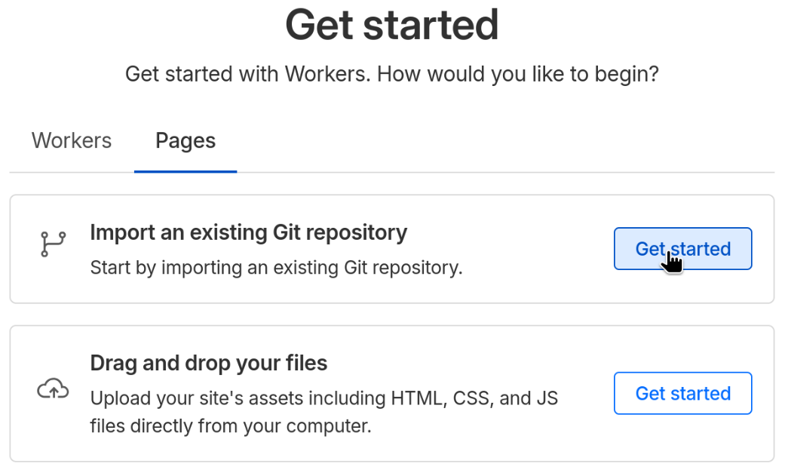

站长不日毕业离校，本站未来交予诸位。

---

<PostDetail>

## 前言

常言道人各有志。BYR Docs 对我来说只是个出于兴趣搭建的服务性站点，在这段时间里，经过一众同学帮助，也算得上小有成绩。

不过我本人很快就要远赴他乡，且有更多自己想做的事情，难以再继续维护 BYR Docs 的运转了。对我来说，BYR Docs 的最佳结局就是有序关停。

但也有不少人受惠于本站，不希望它就此消失。都说授人以鱼不如授人以渔，我想，索性把搭建 BYR Docs 的方法公诸于世，以俟后人重新搭建，岂不更好？

于是我写了这篇文章，并将在未来 BYR Docs 关停之前无条件把全部资料分享到 GitHub/BYRPT 中。余下的事，就留待后人完成了。

## BYR Docs 概况

目前 BYR Docs 的项目主要包括以下部分：

- [BYR Docs 主站](https://byrdocs.org)是我们的主阵地，提供电子书、考试题目和其它资料的直接下载。主站布署于 Cloudflare Worker 中，其文件全部存储于 Cloudflare R2 对象存储服务器中，而可供检索的元信息保存于 [GitHub 仓库](https://github.com/byrdocs/byrdocs-archive)中。
  - [BYR Docs Publish](https://publish.byrdocs.org)附属于主站，实现上传功能。它为一般用户提供更好的文件上传及元信息填写、提交服务。Publish 布署于 Cloudflare Worker 中。
- [维基真题](https://wiki.byrdocs.org)是主站试题部分的延伸，提供可编辑性更强的试题库，允许用户以更零碎的方式贡献试题和答案。维基真题布署于自托管的 MediaWiki 服务器中。
- [BUPT 生存指南](https://guide.byrdocs.org)是另一个独立项目，提供北京邮电大学两校区的生活学习指南，以帮助新生更好地适应学校环境。生存指南布署于 Cloudflare Page 中。

BYR Docs 的几个项目之间都是较为独立的，不存在很强的依赖关系。比如说，你可以只fork [BUPT 生存指南的仓库](https://github.com/byrdocs/bupt-survival-guide)，做成一个单独的生存指南网站；你也可以只下载维基真题的数据库及服务器文件，做成一个单独的维基网站；当然，只搭建主站而抛弃维基也是完全可行的，只不过会缺少一部分来自维基的题目；只搭建主站而不搭建 Publish 也没关系，只是元信息录入会有些麻烦。

不过，Publish 必须配合主站搭建，否则便没有意义。

以下我将分别介绍各个子项目的数据获取/搭建方案。

## BYR Docs 主站

### 所需资料

BYR Docs 需要的资料包括**文件**和**元信息**两部分。byrdocs-archive 仓库中提供了关于[文件](https://github.com/byrdocs/byrdocs-archive/blob/master/docs/%E6%96%87%E4%BB%B6%E8%A7%84%E5%88%99.md)和[元信息](https://github.com/byrdocs/byrdocs-archive/blob/master/docs/%E5%85%83%E4%BF%A1%E6%81%AF%E8%A7%84%E5%88%99.md)的简单规则，供你参考。

BYR Docs 的文件统一存储于 Cloudflare R2 Object Storage 中。

元信息全部存储于 [byrdocs-archive 仓库](https://github.com/byrdocs/byrdocs-archive)中。

BYR Docs 的网站代码位于 [byrdocs 仓库](https://github.com/byrdocs/byrdocs) 中，你只需将其 Fork 并克隆到本地即可。

### 所需环境

- 你需要拥有一个 [Cloudflare 账号](https://dash.cloudflare.com)。
- 你的本地开发环境需要安装 [Node.js](https://nodejs.org) 及 [pnpm](https://pnpm.io/)。
- 本项目的最佳布署方法是使用 [Wrangler CLI](https://developers.cloudflare.com/workers/wrangler/)。你可以通过 `pnpm` 下载它，然后在命令行中使用：
```bash
pnpm i -g wrangler
wrangler login
```

另有一些只在初次搭建时需要，而后续不再需要的依赖，我将在下文提及相关内容时补充。

#### 关于 Cloudflare 资费

> 目前本人维持 BYR Docs 主站所需的支出约为每月 0.4 USD，支出完全由 R2 产生。

- 你可以使用 Cloudflare Workers 的免费订阅，或者每月支付 5 USD 使用 Workers 付费订阅。使用免费订阅不影响网站的正常功能，但存在一定的运行和访问量限制。请参考 [Limits - Cloudflare Docs](https://developers.cloudflare.com/workers/platform/limits/) 并自行评估是否需要付费。
- 本站文件存读所使用的 [R2 Object Storage](https://developers.cloudflare.com/r2/) 容量和操作数可能超出免费额度的限制，Cloudflare 将对超出部分收费，详见 [Pricing - R2](https://developers.cloudflare.com/r2/pricing/)。

### 搭建步骤

因为搭建过程较为繁琐，我将其分为几个子过程，分别加以介绍。
1. [准备 BYR Docs 文件](#准备-byr-docs-文件)

#### 准备 BYR Docs 文件

BYR Docs 的文件位于一个 Cloudflare R2 存储池内，所有文件均位于根目录下，它们分为三类：
- 文件本身，它的 MD5 校验码等于文件名，后缀只能是 `.zip` 或 `.png`；
- 文件附属的 `.webp` 文件，用于网页预览；
- 文件附属的 `.jpg` 文件，用于大图预览。

当你下载 BYR Docs 压缩包后，请先将其解压，得到一个名为 `byrdocs/` 的文件夹。接下来，你可按以下步骤，将文件导入你自己账号下的 R2 存储池中。

1. 建立一个名为 `byrdocs` 的 R2 存储池。
```bash
wrangler r2 bucket create byrdocs
```
2. 建立一组可以通过 Minio 访问并读写 `byrdocs` 存储池的 Token。在 *Storage & databases* -> *R2 object storage* -> *Overview* 中的 *Account Details* 版块下，点击 *Manage* -> *Create Account API token*，为 `byrdocs` 存储池授予 **Object Read & Write** 权限。

3. 当 Token 建立成功后，注意记录并保存完成页面的 Token value, Access Key ID, Secret Access Key 及以 S3 Endpoint。
4. 下载 [Minio Client](https://github.com/minio/mc) 并安装；
5. 通过 Minio 建立一个到你账号 R2 存储池的引用，其中的三个参数分别为第 3 步中你记录下的值。
```bash
mcli alias set r2 <endpoint> <access-key-id> <secret-access-key>
```
6. 通过 Minio 进行文件拷贝。来源目录为你解压得到的 `byrdocs/` 目录，目标目录为 `r2/byrdocs` 存储池。
```bash
mcli cp -r ./byrdocs/ r2/byrdocs
```
7. 拷贝完成后，可以通过 `diff` 检查 R2 存储池的数据是否完整。如果数据不完整，请回到第 6 步。
```bash
mcli diff ./byrdocs/ r2/byrdocs # 如无任何输出且返回值为 0，则数据完整
```
8. 建立一组可以通过 API 访问并只读 `byrdocs` 存储池的 Token。在 *Storage & databases* -> *R2 object storage* -> *Overview* 中的 *Account Details* 版块下，点击 *Manage* -> *Create Account API token*，为 *byrdocs* 存储池授予 **Object Read only** 权限。
9. 当 Token 建立成功后，注意记录并保存完成页面的 Token value, Access Key ID, Secret Access Key 及以 S3 Endpoint。这些信息将用于后续主站对文件的访问。

## 维基真题

维基真题使用 [MediaWiki 软件](https://www.mediawiki.org/wiki/MediaWiki) 搭建而成，配合 Nginx 和 MariaDB，布署在自托管的服务器中。它的搭建过程需要较多繁琐的配置，包括 Nginx、PHP-FPM、MariaDB 等多个方面。

为了降低布署难度，简化操作流程，我推荐使用 MediaWiki 官方提供的 Docker 镜像进行容器化布署；当然，你也可以参考 [MediaWiki 的安装文档](https://www.mediawiki.org/wiki/Manual:Installing_MediaWiki)，探索如何在裸机上进行布署。

### 所需资料

- 一个压缩的数据库文件 `wikibackup.sql.gz`，包含用户数据、站点内容等诸多信息。
- 一个压缩的维基文件夹 `wikifolder.tar.gz`，包含配置文件 `LocalSettings.php` 及扩展、媒体文件和资源文件。

你可以通过以下 Bash 命令将其解压，得到 `wikibackup.sql` 及 `wikifolder/`：

```bash
gzip -d wikibackup.sql.gz # 得到 wikibackup.sql，原文件不保留
tar -xzf wikifolder.tar # 得到 wikifolder/
```

其它解压工具也可。

### 所需环境

- 一台安装了 [Docker Compose](https://github.com/docker/compose) 的计算机。

### 搭建步骤

1. 在你认为合适的位置建立一个任意名称的目录，比如 `wiki.byrdocs/`。
2. 在 `wiki.byrdocs/` 目录内编写 `compose.yaml`。这里仅提供示例代码，建议你自行修改 `services.database.environment` 中的 `MYSQL_DATABASE` `MYSQL_USER` `MYSQL_PASSWORD` 三项。
```yaml
services:
  mediawiki:
    # 维基真题使用的 MediaWiki 版本为 1.43；随着时间推移，你需要自行升级 MediaWiki 版本
    image: mediawiki:1.43
    restart: 'no'
    # 你可自行修改站点的端口号，这里使用 8080
    ports:
      - 8080:80
    links:
      - database
    volumes:
      - ./wikifolder/extensions:/var/www/html/extensions
      - ./wikifolder/images:/var/www/html/images
      - ./wikifolder/resources:/var/www/html/resources
      - ./wikifolder/LocalSettings.php:/var/www/html/LocalSettings.php
  database:
    image: mariadb:lts
    restart: 'no'
    environment:
      MYSQL_DATABASE: my_wiki
      MYSQL_USER: wikiuser
      MYSQL_PASSWORD: example
      MYSQL_RANDOM_ROOT_PASSWORD: 'yes'
    volumes:
      - ./db:/var/lib/mysql
volumes:
  extensions:
  images:
  resources:
  db:
```
3. 将解压后的 `wikifolder/` 移动到 `wiki.byrdocs/` 目录下。
4. 进入 `wiki.byrdocs/` 目录，并运行以下命令：
```
docker-compose up -d
```
5. 待镜像拉取完毕（只有首次拉取镜像时需要）且容器运行稳定（大约需要 10 秒）后，通过 `docker ps` 你可以看到两个新增的容器正在运行。例如在这里，`wikibyrdocs-mediawiki-1` 是服务器容器，`wikibyrdocs-database-1` 是数据库容器。
```
CONTAINER ID   IMAGE            COMMAND                  CREATED          STATUS          PORTS                                     NAMES
1b05fd4356fa   mediawiki:1.43   "docker-php-entrypoi…"   16 seconds ago   Up 16 seconds   0.0.0.0:8080->80/tcp, [::]:8080->80/tcp   wikibyrdocs-mediawiki-1
7c27b51baf95   mariadb:lts      "docker-entrypoint.s…"   16 seconds ago   Up 16 seconds   3306/tcp                                  wikibyrdocs-database-1
```
6. 修改 `wikifolder/LocalSettings.php` 中的内容，以便正确配置 MediaWiki 服务。
    1. `$wgServer` 改为 `http://[ip]:8080`。其中 `[ip]` 是你宿主机的IP 地址（不能使用 `localhost`），端口号需要与你 `compose.yaml` 中指定的端口号相同。
    2. `$wgDBserver` 改为数据库容器的名字，如 `wikibyrdocs-database-1`。
    2. `$wgDBName` `$wgDBuser` `$wgDBpassword` 三项需要和你在 `compose.yaml` 中的配置保持一致。
7. 接下来，通过以下步骤[导入数据库资料](https://www.mediawiki.org/wiki/Manual:Restoring_a_wiki_from_backup#Import_the_database_backup)。
    1. 将 sql 文件拷贝到容器内部。
    ```bash
    docker cp wikibackup.sql wikibyrdocs-database-1:/root/
    ```
    2. 进入容器内部进行操作。
    ```bash
    docker exec -it wikibyrdocs-database-1 bash
    ```
    3. 先销毁原有的数据库。其中的用户名、数据库名和密码与先前写在 `compose.yaml` 中的相同。
    ```bash
    mariadb-admin -u wikiuser -p drop my_wiki
    ```
    4. 新建空数据库 `my_wiki`。
    ```bash
    mariadb-admin -u wikiuser -p create my_wiki
    ```
    5. 向 `my_wiki` 中导入数据。
    ```bash
    mariadb -u wikiuser -p my_wiki < /root/wikibackup.sql
    ```
    6. 退出容器。
    ```bash
    exit
    ```
8. 重启服务。
```bash
docker-compose restart
```
9. 最后，通过浏览器访问 `http://localhost:8080/w/首页`，你可以看到维基真题的完整网页（如果你是在远程布署的，请将 IP 地址换作你远程主机的 IP）。

### 后续维护

#### 行政员

MediaWiki 系统需要至少存在一名**行政员**，才能为其它用户授予各类用户组权限。新站长可向旧站[行政员列表](https://wiki.byrdocs.org/index.php?title=%E7%89%B9%E6%AE%8A:%E7%94%A8%E6%88%B7%E5%88%97%E8%A1%A8&group=bureaucrat)中的任何一位索取管理员、行政员及其它用户组权限。（若链接失效，请发邮咨询 cpphusky@gmail.com）。

行政员直接关系到全部用户权限的授予和剥夺，请谨慎使用你的权限！

#### 维基真题备份

> 主条目：[Manual:Backing up a wiki - MediaWiki](https://www.mediawiki.org/wiki/Manual:Backing_up_a_wiki)

你可能像我一样，会在某一天将维基真题的资料打包好，交付给下一位站长。你需要为他准备的内容一如我为你准备的内容：

- 一个 `wikibackup.sql.gz` 数据库文件；
- 一个 `wikifolder.tar.gz` 维基文件夹。

即便你尚无打算转手维基真题，定期备份也是个好习惯。

1. 在进行备份之前，请先在 `wikifolder/LocalSettings.php` 中添加一行
```php
$wgReadOnly = 'MediaWiki维护中，请注意保存你的更改，以待给护结束后提交。';
```
2. 重启服务：
```bash
docker compose restart
```
3. 通过 `mariadb-dump` 生成数据库文件：
```bash
mariadb-dump -h localhost -u wikiuser -p --default-character-set=utf8 my_wiki > /root/wikibackup.sql
gzip /root/wikibackup.sql # 通过压缩减小其体积，得到 wikibackup.sql.gz
# 将该文件从容器中拷贝出来即可
```
4. 维基文件夹可以直接打包宿主机内的 `wiki.byrdocs/wikifolder/` 目录得到：
```bash
tar -czf wikifolder.tar.gz wikifolder/ # 得到 wikifolder.tar.gz
```

## BUPT 生存指南

BUPT 生存指南基于 [Astro Starlight](https://starlight.astro.build/) 搭建，可以快捷、简单地生成静态的文档网站。无论要在本地搭建，还是使用 Pages 服务，都十分方便。

你可以选择使用自托管服务器或 Cloudflare Pages （及其它 Pages 服务）搭建本站。不过一般来说，即便你选择了 Pages 服务，为了测试网站效果，本地搭建和预览也是必要的。

接下来我将介绍如何本地搭建和使用 Cloudflare Pages 搭建。

### 所需资料

BUPT 生存指南的全部文件是一个 [GitHub 仓库](https://github.com/byrdocs/bupt-survival-guide)，你可直接 [Fork 该仓库](https://github.com/byrdocs/bupt-survival-guide/fork)。

### 本地搭建

需要安装 [Node.js](https://nodejs.org) 及 [pnpm](https://pnpm.io/)。

1. 将该仓库内容克隆到本地，打开所在目录。
2. 下载依赖。
```bash
pnpm i
```
3. 启动开发服务器。访问 `http://localhost:4321`，你可以看到网站的内容，并使用一些基本功能。在 `dev` 模式下，这个网站会随着你的文档代码更新而热加载。
```bash
pnpm dev # 开始 dev 预览模式
```
4. 完成文档工作后，你可以构建完整网页并使用它的全部功能。
```bash
pnpm build # 此时网页代码将被编译至 `dist/` 中
pnpm preview # 本地查看，也可加 --host 暴露给公网
```

### 使用 Cloudflare Pages 搭建

需要拥有一个 [Cloudflare 账号](https://dash.cloudflare.com)。如果只需搭建 BUPT 生存指南，你无需付费或填写任何付款方式。

1. 打开 [Cloudflare 控制台](https://dash.cloudflare.com)，选中侧边栏的 *Build* -> *Compute & AI* -> *Workers & Pages*，并在主界面点击 *Create Application*。
2. 在 Get Started 页面中，选择 *Pages* -> *Import an existing Git repository*。

3. 初次使用时，你可能需要绑定一个 GitHub 账号。绑定账号之后，从该账号名下的全部仓库中选择你 fork 的仓库，然后点击右下角 *Begin setup*。
4. 在配置列表中，需要指定 *Framework preset* 为 **Astro**，*Build command* 为 `pnpm build`，*Build output directory* 为 `dist`，其它配置可以自行修改。配置完毕后点击右下角 *Save and Deploy*，开始部署你的网站。

5. 等待 Cloudflare 布署完毕，而后你可以查看该网站。

此时该 Page 已经与你绑定的 GitHub 仓库建立连接。每当 GitHub 仓库发生更新时，该 Page 都会获取更新并重新布署，非常方便。

</PostDetail>
